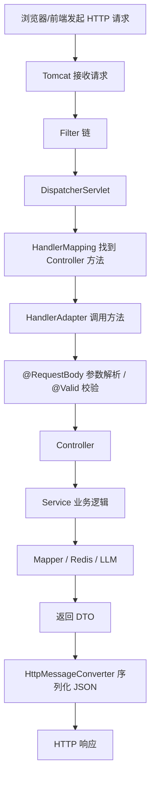

# 02 Spring Boot 与 Spring MVC

> 目标：能讲清楚 Spring Boot 为什么能快速启动项目、一次 HTTP 请求如何进入 Controller、IOC/AOP 是什么、Controller/Service/Mapper 为什么分层，以及这些概念在本项目中的落地。

## 1. 最短面试回答

```text
Spring Boot 是对 Spring 生态的工程化封装，核心价值是自动配置、起步依赖和内嵌容器，让我们能快速搭建可运行的 Web 服务。

Spring MVC 负责处理 HTTP 请求。一次请求大致经过 Servlet 容器、过滤器链、DispatcherServlet、HandlerMapping、Controller 方法、MessageConverter，最后把对象序列化成 JSON 响应。

项目中我按 Controller、Service、Mapper 分层：Controller 负责接收请求和参数校验，Service 负责业务编排，Mapper 负责数据库访问。认证、知文、RAG 接口都是这个结构。
```

## 2. 项目源码锚点

- `src/main/java/com/tongji/ZhiGuangApplication.java`
  - Spring Boot 启动类。
- `src/main/java/com/tongji/auth/api/AuthController.java`
  - 认证 Controller。
- `src/main/java/com/tongji/auth/service/AuthService.java`
  - 认证业务 Service。
- `src/main/java/com/tongji/knowpost/api/KnowPostRagController.java`
  - RAG 流式接口 Controller。
- `src/main/java/com/tongji/llm/rag/RagQueryService.java`
  - RAG 查询业务。
- `src/main/java/com/tongji/common/web/GlobalExceptionHandler.java`
  - 全局异常处理。
- `src/main/java/com/tongji/auth/config/SecurityConfig.java`
  - Spring Security 过滤链配置。
- `pom.xml`
  - `spring-boot-starter-web`
  - `spring-boot-starter-validation`
  - `spring-boot-starter-security`

## 3. Spring 是什么

Spring 是 Java 企业开发框架，核心能力：

- IOC 容器：管理对象创建和依赖关系。
- AOP：面向切面编程，适合事务、日志、安全等横切逻辑。
- Web MVC：Web 请求处理。
- 事务管理。
- 数据访问集成。
- 与 Security、Redis、MyBatis、AI 等生态整合。

面试里不要把 Spring 说成“一个 MVC 框架”。Spring 的核心是容器和生态。

## 4. Spring Boot 是什么

Spring Boot 不是替代 Spring，而是让 Spring 项目更容易启动、配置和部署。

核心能力：

### 4.1 起步依赖

比如项目里：

```xml
<dependency>
    <groupId>org.springframework.boot</groupId>
    <artifactId>spring-boot-starter-web</artifactId>
</dependency>
```

一个 starter 会帮你引入一组常用依赖，比如 Spring MVC、Jackson、内嵌 Tomcat。

### 4.2 自动配置

Spring Boot 会根据 classpath 中的依赖和配置文件，自动创建常见 Bean。

例如：

- 引入 `spring-boot-starter-web`：自动配置 Web MVC。
- 引入 `spring-boot-starter-data-redis`：自动配置 RedisTemplate 相关能力。
- 引入 `spring-boot-starter-security`：自动开启安全过滤链。

### 4.3 内嵌容器

传统 Java Web 可能要把 war 包放进外部 Tomcat。Spring Boot 默认可以打成 jar，内嵌 Tomcat，直接运行：

```bash
java -jar app.jar
```

### 4.4 配置外部化

项目使用：

- `src/main/resources/application.yml`
- `src/main/resources/application-local.yml`

配置可以按环境区分，比如数据库、Redis、大模型 API Key、OSS 配置。

## 5. IOC 和 DI

### 5.1 IOC 是什么

IOC：Inversion of Control，控制反转。

原来对象由你自己 new：

```java
UserService userService = new UserServiceImpl();
```

用了 Spring 后，对象由容器创建和管理，你只声明依赖：

```java
@Service
public class AuthService {
    private final UserService userService;
}
```

控制权从业务代码转移到了 Spring 容器。

### 5.2 DI 是什么

DI：Dependency Injection，依赖注入。

IOC 是思想，DI 是实现方式。

项目里常见构造器注入：

```java
@Service
@RequiredArgsConstructor
public class AuthService {
    private final UserService userService;
    private final VerificationService verificationService;
    private final JwtService jwtService;
}
```

`@RequiredArgsConstructor` 由 Lombok 生成构造器，Spring 根据构造器参数注入 Bean。

### 5.3 为什么推荐构造器注入

- 依赖不可变，可以 `final`。
- 创建对象时依赖完整。
- 单元测试更方便。
- 避免字段注入隐藏循环依赖。

面试回答：

```text
IOC 是把对象创建和依赖管理交给 Spring 容器，DI 是容器把依赖注入给对象的方式。项目里 Service 基本使用构造器注入，配合 final 字段和 Lombok 的 @RequiredArgsConstructor，让依赖更清晰。
```

## 6. Bean 是什么

Bean 是被 Spring 容器管理的对象。

常见来源：

- `@Component`
- `@Service`
- `@Repository`
- `@Controller`
- `@RestController`
- `@Configuration` + `@Bean`

项目例子：

```java
@Configuration
public class LlmConfig {
    @Bean
    public ChatClient chatClient(@Qualifier("deepSeekChatModel") ChatModel chatModel) {
        return ChatClient.builder(chatModel).build();
    }
}
```

这里 `ChatClient` 是手动声明的 Bean。

## 7. Bean 生命周期

第一阶段掌握简化版：

```text
扫描 Bean 定义
-> 实例化对象
-> 注入依赖
-> 初始化
-> 放入容器
-> 业务使用
-> 容器关闭时销毁
```

面试回答：

```text
Spring Bean 大致经历实例化、属性注入、初始化、使用和销毁。实际过程中还会经过 BeanPostProcessor 等扩展点，AOP 代理也通常在初始化前后生成。
```

## 8. AOP

AOP：Aspect Oriented Programming，面向切面编程。

解决的问题：

业务代码中会有很多横切逻辑：

- 事务。
- 日志。
- 权限。
- 缓存。
- 监控。

这些逻辑散落在业务方法中会很乱。AOP 可以把它们抽出去。

项目最常见的 AOP 应用是事务：

```java
@Transactional
public void createUser(User user) {
    ...
}
```

Spring 会为目标对象创建代理，在方法执行前后开启、提交或回滚事务。

### 8.1 AOP 关键术语

- Aspect：切面。
- Join Point：连接点，通常是方法执行。
- Pointcut：切点，匹配哪些方法。
- Advice：通知，方法前后执行的增强逻辑。
- Proxy：代理对象。

### 8.2 高频追问：`@Transactional` 什么时候失效？

常见场景：

- 方法不是 public。
- 同类内部方法自调用。
- 异常被 catch 没有抛出。
- 默认只回滚 RuntimeException，受检异常需要配置。
- 对象不是 Spring 容器管理的 Bean。

面试回答：

```text
@Transactional 基于 Spring AOP 代理，如果同一个类内部 this.method() 自调用，不会经过代理，因此事务可能失效。另外异常被吞掉、方法不是 public、对象不是 Spring Bean，也可能导致事务不生效。
```

## 9. Spring MVC 请求链路

一次请求大致链路：



项目例子：

```java
@RestController
@RequestMapping("/api/v1/knowposts")
public class KnowPostRagController {
    @GetMapping(value = "/{id}/qa/stream", produces = MediaType.TEXT_EVENT_STREAM_VALUE)
    public Flux<String> qaStream(...) {
        return ragQueryService.streamAnswerFlux(id, question, topK, maxTokens);
    }
}
```

请求命中 `/api/v1/knowposts/{id}/qa/stream` 后，Spring MVC/WebFlux 适配层把路径参数、查询参数绑定到方法参数，调用 Service，最后返回流式响应。

## 10. Controller、Service、Mapper 分层

### 10.1 Controller

职责：

- 定义 URL。
- 接收请求参数。
- 做基础参数校验。
- 调用 Service。
- 返回 DTO。

不应该：

- 写复杂业务逻辑。
- 直接拼 SQL。
- 直接操作多个基础设施形成复杂流程。

### 10.2 Service

职责：

- 业务编排。
- 事务边界。
- 调用 Mapper、Redis、外部 API。
- 抛出业务异常。

项目例子：

`AuthService.register` 里编排：

```text
协议校验
-> 账号格式校验
-> 账号存在校验
-> 验证码校验
-> 构造 User
-> BCrypt 加密密码
-> 写入数据库
-> 签发 JWT
-> refresh token 写 Redis
-> 记录登录日志
```

### 10.3 Mapper

职责：

- 数据库 CRUD。
- SQL 映射。
- 参数绑定。
- 结果映射。

项目例子：

`UserMapper` 和 `UserMapper.xml`。

## 11. 常用注解

### 11.1 Web 注解

- `@RestController`：`@Controller + @ResponseBody`。
- `@RequestMapping`：类或方法级路径映射。
- `@GetMapping`、`@PostMapping`：HTTP 方法映射。
- `@PathVariable`：路径参数。
- `@RequestParam`：查询参数。
- `@RequestBody`：请求体 JSON。
- `@Valid`：触发 Bean Validation。

### 11.2 组件注解

- `@Component`：通用组件。
- `@Service`：业务服务。
- `@Repository`：数据访问。
- `@Configuration`：配置类。
- `@Bean`：手动注册 Bean。

### 11.3 配置注解

- `@ConfigurationProperties`：把配置绑定到 Java 对象。
- `@EnableConfigurationProperties`：启用配置属性绑定。
- `@Qualifier`：多个同类型 Bean 时指定名称。

项目例子：

```java
public ChatClient chatClient(@Qualifier("deepSeekChatModel") ChatModel chatModel)
```

因为可能存在多个 `ChatModel`，所以用 `@Qualifier` 指定 DeepSeek。

## 12. 参数校验

项目引入：

```xml
spring-boot-starter-validation
```

DTO 中可以用：

```java
@NotBlank
@Email
@Size(min = 8)
```

Controller 中使用：

```java
public AuthResponse login(@Valid @RequestBody LoginRequest request)
```

好处：

- 基础格式校验前置。
- 避免 Service 充满重复 if。
- 错误统一交给全局异常处理。

## 13. 全局异常处理

项目中通常使用：

```java
@RestControllerAdvice
public class GlobalExceptionHandler {
    @ExceptionHandler(BusinessException.class)
    ...
}
```

价值：

- 统一错误响应格式。
- Controller 不用写大量 try-catch。
- 业务异常和系统异常分开处理。
- 方便日志记录。

面试回答：

```text
项目里业务层遇到验证码错误、账号已存在、密码错误时抛 BusinessException，再由 @RestControllerAdvice 统一转成 HTTP 响应。这样接口错误格式一致，也让 Controller 更干净。
```

## 14. Spring MVC 和 WebFlux

### 14.1 Spring MVC

基于 Servlet，典型线程模型：

```text
一个请求通常由一个线程处理，直到响应完成。
```

适合：

- 普通 REST API。
- 阻塞式数据库访问。
- 传统 Spring Boot 后端。

### 14.2 WebFlux

响应式模型，常见类型：

- `Mono<T>`：0 或 1 个结果。
- `Flux<T>`：0 到多个结果。

项目 RAG 流式接口返回：

```java
public Flux<String> qaStream(...)
```

这表示模型输出不是一次性返回，而是一段一段流式返回。

### 14.3 面试怎么答

```text
项目主体是 Spring MVC 风格的 REST API，但 RAG 问答接口返回 Flux<String>，配合 text/event-stream 实现流式输出。这样用户不必等模型完整生成完，前端可以边接收边展示。
```

## 15. 高频面试题

### Q1：Spring Boot 的核心优势是什么？

答：

```text
核心是自动配置、起步依赖、内嵌容器和外部化配置。它不是替代 Spring，而是降低 Spring 项目搭建和部署成本。
```

### Q2：IOC 和 DI 区别？

答：

```text
IOC 是控制反转思想，把对象创建和依赖管理交给容器；DI 是依赖注入，是实现 IOC 的一种方式。项目里 Service 通过构造器注入依赖。
```

### Q3：Spring Bean 默认是单例吗？线程安全吗？

答：

```text
Spring Bean 默认是单例，但单例不等于线程安全。如果 Bean 内部没有共享可变状态，一般是线程安全的；如果保存了可变成员变量，就要考虑并发问题。项目中的 Service 通常是无状态的，依赖数据库、Redis 等外部存储保存状态。
```

### Q4：一次请求到 Controller 经历了什么？

答：

```text
请求先到 Tomcat，然后经过过滤器链，再到 DispatcherServlet。DispatcherServlet 通过 HandlerMapping 找到对应 Controller 方法，通过 HandlerAdapter 调用，期间完成参数绑定、消息转换和校验。方法返回后再通过 HttpMessageConverter 序列化成 JSON 或其他响应。
```

### Q5：`@RestController` 和 `@Controller` 区别？

答：

```text
@RestController 等价于 @Controller + @ResponseBody，方法返回值直接写入 HTTP 响应体，通常用于 REST API。@Controller 常用于返回视图页面。
```

### Q6：`@RequestParam` 和 `@PathVariable` 区别？

答：

```text
@PathVariable 取 URL 路径中的变量，比如 /users/{id}；@RequestParam 取查询参数，比如 /users?id=1。
```

### Q7：为什么要分 Controller、Service、Mapper？

答：

```text
分层能降低耦合。Controller 负责协议和参数，Service 负责业务编排和事务，Mapper 负责数据库访问。这样接口变化、业务变化、SQL 变化互相影响更小，也方便测试和维护。
```

### Q8：Spring AOP 常用于什么？

答：

```text
常用于事务、日志、权限、缓存、监控等横切逻辑。比如 @Transactional 就是典型 AOP 应用。
```

### Q9：`@Transactional` 为什么会失效？

答：

```text
常见原因包括同类内部自调用没有经过代理、方法不是 public、异常被捕获没有抛出、默认不回滚受检异常、对象不是 Spring Bean。
```

### Q10：Spring MVC 和 WebFlux 区别？

答：

```text
Spring MVC 基于 Servlet 阻塞模型，适合传统 REST API；WebFlux 是响应式非阻塞模型，常用 Mono/Flux 表示异步结果流。项目里的 RAG 接口用 Flux<String> 做模型流式输出。
```

## 16. 项目讲法

```text
知光项目整体是典型 Spring Boot 分层架构。认证模块中 AuthController 负责暴露注册、登录、刷新令牌等接口；AuthService 负责编排验证码校验、密码校验、JWT 签发、Redis 白名单写入；UserMapper 负责访问 users 表。

AI/RAG 模块中 KnowPostRagController 暴露 /qa/stream 流式接口，RagQueryService 负责索引检查、向量检索、Prompt 构造和 ChatClient 流式调用。这种分层让我在面试时能清楚讲出请求从接口层到业务层再到基础设施的链路。
```

## 17. 可优化点

你可以准备 2 个优化回答：

1. RAG 接口目前允许匿名访问，真实生产环境应考虑限流、鉴权或成本控制。
2. Controller 层可以进一步统一响应格式，避免有的接口直接返回 int、有的返回 DTO。

## 18. 自测清单

- Spring Boot 和 Spring 的关系？
- starter 是什么？
- 自动配置大概怎么理解？
- IOC 和 DI 怎么讲？
- Bean 生命周期简化流程？
- 为什么推荐构造器注入？
- AOP 是什么？
- `@Transactional` 失效场景？
- 一次请求如何进入 Controller？
- Controller/Service/Mapper 各负责什么？
- `@RestController` 和 `@Controller` 区别？
- `@RequestBody`、`@RequestParam`、`@PathVariable` 区别？
- 项目里哪个接口用了 `Flux<String>`？

