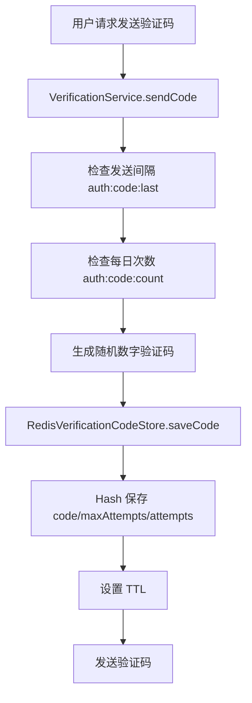

# 04 Redis

> 目标：能讲清楚 Redis 为什么快、常见数据类型、TTL、验证码和 refresh token 为什么适合放 Redis，以及缓存常见问题。重点贴合本项目认证模块。

## 1. 最短面试回答

```text
Redis 是内存型 key-value 数据库，读写性能高，支持丰富数据结构和 TTL。项目里主要用 Redis 存验证码、发送频率限制、每日次数限制、refresh token 白名单，也用于计数和缓存。

验证码适合 Redis，因为它生命周期短、访问频繁、过期后自动删除；refresh token 白名单适合 Redis，因为 JWT 本身无状态但长期 token 需要可撤销，Redis TTL 正好能让白名单跟随 token 自动过期。
```

## 2. 项目源码锚点

- `src/main/java/com/tongji/auth/verification/RedisVerificationCodeStore.java`
  - 验证码 Hash + TTL。
- `src/main/java/com/tongji/auth/verification/VerificationService.java`
  - 发送间隔限制、每日次数限制。
- `src/main/java/com/tongji/auth/token/RedisRefreshTokenStore.java`
  - refresh token 白名单。
- `src/main/java/com/tongji/counter/*`
  - 计数系统使用 Redis。
- `src/main/java/com/tongji/cache/*`
  - 缓存配置和热点探测。

## 3. Redis 是什么

Redis 是基于内存的数据存储，常用作：

- 缓存。
- 分布式锁。
- 计数器。
- 排行榜。
- 验证码。
- 会话或 token 状态。
- 消息队列的轻量场景。

Redis 是单线程执行命令模型为主，但不是所有工作都只有一个线程。第一阶段面试可以说：

```text
Redis 命令处理主要是单线程事件循环，避免了多线程锁竞争；数据在内存中，配合高效数据结构和 IO 多路复用，所以性能很高。
```

## 4. Redis 为什么快

常见原因：

1. 数据主要在内存中。
2. 命令执行模型简单，避免复杂锁竞争。
3. IO 多路复用处理大量连接。
4. 数据结构高效。
5. Redis 命令通常设计得很短小。

面试回答：

```text
Redis 快主要因为数据在内存中，命令处理模型减少了锁竞争，同时使用 IO 多路复用处理网络连接，并且内部数据结构针对常见操作做了优化。
```

## 5. Redis 常见数据类型

### 5.1 String

最基础类型。

用途：

- 缓存 JSON。
- 计数器。
- 分布式锁值。
- token 白名单。

项目例子：

```java
redisTemplate.opsForValue().set(key, "1", ttl);
```

用于 refresh token 白名单。

### 5.2 Hash

适合保存对象字段。

项目验证码：

```text
auth:code:{scene}:{identifier}
  code
  maxAttempts
  attempts
```

代码：

```java
ops.put(key, FIELD_CODE, code);
ops.put(key, FIELD_MAX_ATTEMPTS, String.valueOf(maxAttempts));
ops.put(key, FIELD_ATTEMPTS, "0");
redisTemplate.expire(key, ttl);
```

### 5.3 List

有序列表。

用途：

- 简单队列。
- 最新消息列表。

### 5.4 Set

无序去重集合。

用途：

- 标签去重。
- 用户集合。
- 共同关注。

### 5.5 ZSet

有序集合，每个元素有 score。

用途：

- 排行榜。
- Feed 流。
- 按时间排序集合。

### 5.6 Bitmap

位图。

用途：

- 签到。
- 是否点赞/收藏。
- 大规模布尔状态。

项目计数系统里有类似使用。

## 6. TTL

TTL：Time To Live，键的剩余生存时间。

设置方式：

```java
redisTemplate.opsForValue().set(key, "1", ttl);
redisTemplate.expire(key, ttl);
```

命令概念：

```redis
SET key value EX 60
EXPIRE key 60
TTL key
```

适合 TTL 的数据特征：

- 临时数据。
- 过期后没有业务价值。
- 不希望人工清理。
- 访问频繁但生命周期短。

## 7. 验证码为什么适合放 Redis

验证码特点：

- 有效期短，比如 5 分钟。
- 校验后应该失效。
- 需要限制尝试次数。
- 需要限制发送频率。
- 数据量可能较大，但价值短暂。

项目实现：

```text
auth:code:{scene}:{identifier}
```

Hash 字段：

```text
code
maxAttempts
attempts
```

链路：



面试回答：

```text
验证码天然是短生命周期数据，过期后没有保存价值。Redis 支持 TTL，可以自动过期；Hash 能保存 code、尝试次数、最大尝试次数；INCR 适合做发送次数限制。所以验证码比起放 MySQL，更适合放 Redis。
```

## 8. refresh token 为什么适合放 Redis

JWT 本身是无状态的，一旦签发，服务端不查数据库也能验签。

问题：

```text
如果 refresh token 有效期 7 天，用户登出或密码重置后，如何让旧 refresh token 立即失效？
```

项目方案：

```text
access token: 短期，保持无状态。
refresh token: 长期，jti 存 Redis 白名单。
```

Redis key：

```text
auth:rt:{userId}:{tokenId}
```

写入：

```java
redisTemplate.opsForValue().set(key, "1", ttl);
```

刷新时：

```java
if (!refreshTokenStore.isTokenValid(userId, tokenId)) {
    throw new BusinessException(ErrorCode.REFRESH_TOKEN_INVALID);
}
```

登出时：

```java
redisTemplate.delete(key);
```

面试回答：

```text
refresh token 有效期长，需要可撤销。项目把 refresh token 的 jti 存入 Redis 白名单，并设置和 token 剩余有效期一致的 TTL。刷新时不仅校验 JWT 签名和 exp，还要检查 Redis 白名单是否存在。登出或重置密码时删除白名单，就能让 refresh token 立即失效。
```

## 9. Redis 原子操作

Redis 单条命令具有原子性。

项目每日次数：

```java
Long count = stringRedisTemplate.opsForValue().increment(key);
if (count != null && count == 1L) {
    stringRedisTemplate.expire(key, Duration.ofDays(1));
}
```

`INCR` 是原子递增。

注意：

```text
多个命令组合不一定整体原子。
```

比如：

```text
INCR key
EXPIRE key
```

中间如果宕机，可能出现没有 TTL 的 key。

更严谨可以用：

- Lua 脚本。
- Redis 事务。
- SET NX EX 组合命令。

## 10. 分布式锁基础

Redis 常用分布式锁命令：

```redis
SET lock_key request_id NX EX 10
```

含义：

- `NX`：不存在才设置。
- `EX`：设置过期时间。
- value 用唯一 requestId，防止误删别人的锁。

释放锁要校验 value 再删，通常用 Lua 保证原子性。

项目引入了 Redisson，可以用于更高级的分布式锁能力。

第一阶段面试回答：

```text
Redis 分布式锁通常用 SET key value NX EX seconds 加锁，用唯一 value 标识持有者，释放时用 Lua 校验 value 后删除。项目引入 Redisson，它封装了锁续期、释放等细节。
```

## 11. 缓存穿透、击穿、雪崩

### 11.1 缓存穿透

查询不存在的数据，每次都打到数据库。

解决：

- 缓存空值。
- 布隆过滤器。
- 参数校验。

### 11.2 缓存击穿

热点 key 过期，大量请求同时打到数据库。

解决：

- 互斥锁。
- 逻辑过期。
- 热点 key 不过期或提前刷新。

### 11.3 缓存雪崩

大量 key 同时过期，或 Redis 故障，导致请求打爆数据库。

解决：

- TTL 加随机抖动。
- 多级缓存。
- 限流降级。
- Redis 高可用。

项目 README 提到 Feed 三级缓存和 TTL 抖动，这是很好的面试素材。

## 12. Redis 与 MySQL 一致性

常见策略：

```text
先更新数据库，再删除缓存。
```

为什么不是先删缓存再更新数据库？

可能出现：

```text
线程 A 删除缓存
线程 B 查询数据库旧值并写回缓存
线程 A 更新数据库新值
最终缓存还是旧值
```

为什么不是更新数据库后直接更新缓存？

- 并发下更新顺序可能错乱。
- 缓存结构可能复杂。
- 删除缓存更简单，让下次查询回源重建。

面试回答：

```text
常见做法是更新数据库后删除缓存，下一次查询再回源重建缓存。如果对一致性要求更高，可以结合延迟双删、消息队列、binlog 订阅、版本号等机制。
```

## 13. 项目中的 Redis Key

认证相关：

| key | 类型 | 用途 | TTL |
|---|---|---|---|
| `auth:code:{scene}:{identifier}` | Hash | 验证码、尝试次数 | 验证码有效期 |
| `auth:code:last:{scene}:{identifier}` | String | 发送间隔限制 | 发送间隔 |
| `auth:code:count:{scene}:{identifier}:{date}` | String | 每日发送次数 | 约 1 天 |
| `auth:rt:{userId}:{tokenId}` | String | refresh token 白名单 | refresh token 剩余有效期 |

## 14. 项目当前可优化点

### 14.1 `revokeAll` 使用 `KEYS`

项目：

```java
var keys = redisTemplate.keys(pattern);
```

生产风险：

- `KEYS` 会扫描整个 keyspace。
- key 很多时可能阻塞 Redis。

优化：

- 使用 `SCAN` 增量扫描。
- 或维护用户 tokenId Set：`auth:rt:index:{userId}`。

面试话术：

```text
当前 revokeAll 用 KEYS 做全量匹配，学习项目可以接受，但生产环境我会改为 SCAN 或维护用户 tokenId 索引集合，避免阻塞 Redis。
```

### 14.2 验证码校验多个命令非原子

项目校验验证码：

```text
HGETALL
比较 code
HSET attempts
成功 DELETE
```

并发下尝试次数可能不够严格。

优化：

- 使用 Lua 脚本把读取、比较、递增、删除合成一个原子操作。

面试话术：

```text
验证码校验当前是多条 Redis 命令，普通场景够用。如果对并发安全要求更高，我会用 Lua 脚本保证校验、递增 attempts、成功删除整体原子。
```

## 15. 高频面试题

### Q1：Redis 为什么快？

答：

```text
Redis 数据主要在内存中，命令执行模型简单，减少锁竞争；同时使用 IO 多路复用处理连接，内部数据结构也比较高效。
```

### Q2：Redis 常见数据类型？

答：

```text
String、Hash、List、Set、ZSet，还有 Bitmap、HyperLogLog、Stream 等。项目验证码用 Hash，refresh token 白名单用 String，计数和 Feed 可以用 Bitmap、Hash、ZSet 等结构。
```

### Q3：验证码为什么放 Redis？

答：

```text
验证码有效期短、访问频繁、需要自动过期和尝试次数限制。Redis 支持 TTL、Hash 和原子递增，能很好满足这些需求，没必要写入 MySQL。
```

### Q4：refresh token 为什么放 Redis？

答：

```text
JWT 本身无状态，不方便主动撤销。refresh token 有效期长，需要登出、重置密码后可失效。项目把 refresh token 的 jti 存 Redis 白名单，设置 TTL，刷新时检查白名单，删除 key 即可撤销。
```

### Q5：Redis 的单条命令是原子的吗？

答：

```text
单条 Redis 命令是原子执行的，但多条命令组合不一定整体原子。如果需要组合原子性，可以用 Lua 脚本或事务。
```

### Q6：缓存穿透怎么解决？

答：

```text
缓存空值、布隆过滤器、参数校验。比如查不存在的用户 ID，可以短时间缓存空结果，避免每次都打数据库。
```

### Q7：缓存击穿怎么解决？

答：

```text
热点 key 过期时可以用互斥锁、逻辑过期、提前刷新或热点不过期策略，避免大量请求同时回源。
```

### Q8：缓存雪崩怎么解决？

答：

```text
TTL 加随机抖动，避免大量 key 同时过期；同时可以使用多级缓存、限流降级和 Redis 高可用。
```

### Q9：更新数据库和缓存的顺序？

答：

```text
常见策略是先更新数据库，再删除缓存，下次查询回源重建。对强一致要求更高时可以结合消息队列、binlog、延迟双删等方案。
```

### Q10：`KEYS` 有什么问题？

答：

```text
KEYS 会遍历整个 keyspace，数据量大时可能阻塞 Redis。生产环境更推荐 SCAN 增量扫描，或者维护额外索引集合。
```

## 16. 项目讲法

```text
项目认证模块用 Redis 管理短生命周期和需要快速校验的数据。验证码用 Redis Hash 保存 code、maxAttempts、attempts，并设置 TTL；发送间隔和每日次数用 String + TTL + INCR 实现。

refresh token 方面，项目使用 JWT 双令牌。access token 短期无状态，refresh token 长期但把 jti 存入 Redis 白名单，key 是 auth:rt:{userId}:{tokenId}。刷新时同时校验 JWT 和 Redis 白名单，登出时删除白名单，实现长期 token 可撤销。
```

## 17. 自测清单

- Redis 为什么快？
- String、Hash、List、Set、ZSet 分别适合什么？
- TTL 是什么？
- 验证码为什么适合 Redis？
- refresh token 白名单为什么适合 Redis？
- Redis 单命令原子和多命令原子的区别？
- `INCR` 可以做什么？
- 分布式锁基本命令是什么？
- 缓存穿透、击穿、雪崩分别是什么？
- Redis 和 MySQL 如何保持一致？
- 项目 Redis key 有哪些？
- 项目 Redis 实现有什么可优化点？

