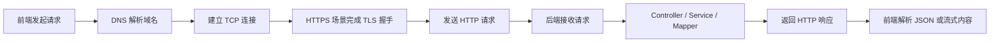
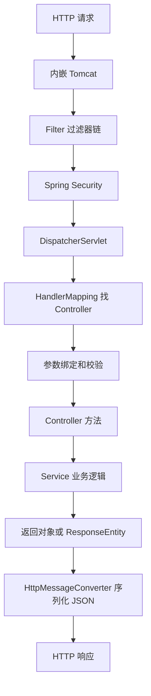
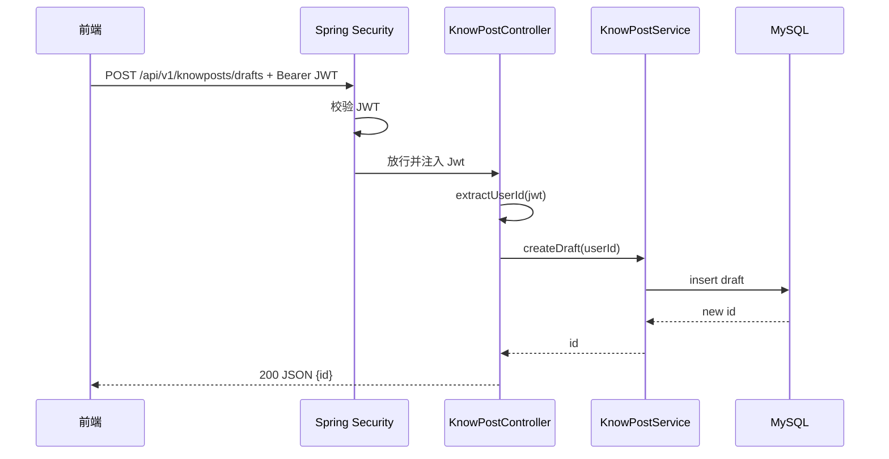
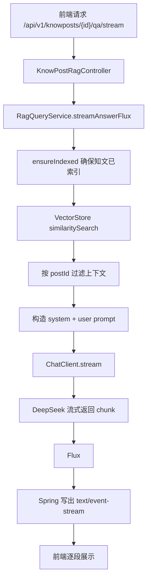

# 06 HTTP、RESTful 与 SSE

> 目标：从零掌握 Web API 的核心知识，能在面试里讲清楚 HTTP 请求响应、无状态、常见方法和状态码、RESTful 接口设计、CORS、JWT 鉴权、SSE 流式输出，以及这些概念在当前知光项目中的落地。

## 0. 学习优先级

### P0 必须掌握

- HTTP 是请求-响应协议，本身无状态。
- HTTP 请求由请求行、Header、Body 组成。
- HTTP 响应由状态行、Header、Body 组成。
- 常见方法：GET、POST、PUT、PATCH、DELETE、OPTIONS。
- 安全性和幂等性：
  - GET 安全且幂等。
  - PUT 通常幂等。
  - DELETE 通常幂等。
  - POST 通常不幂等。
  - PATCH 不一定幂等。
- 常见状态码：200、201、204、400、401、403、404、409、429、500。
- RESTful 是一种资源导向的接口设计风格。
- URL 表示资源，HTTP 方法表示操作，状态码表示结果。
- 前后端分离项目常用 JSON 作为请求/响应格式。
- JWT 放在 `Authorization: Bearer <token>` 中。
- CORS 是浏览器同源策略下的跨域资源共享机制。
- SSE 是 Server-Sent Events，服务端通过 `text/event-stream` 单向推送文本事件。
- AI 流式回答适合 SSE，因为用户发起问题后，主要是服务端持续返回生成片段。

### P1 建议掌握

- HTTP Header 的分类：认证、内容协商、缓存、跨域、代理。
- RESTful 的分页、过滤、排序、版本号、错误响应设计。
- 401 和 403 的本质区别。
- 400、409、422 在业务错误里的取舍。
- CORS 预检请求 OPTIONS 的触发条件。
- SSE 消息格式：`event`、`data`、`id`、`retry`。
- EventSource 和 fetch streaming 的区别。
- SSE、WebSocket、长轮询的适用场景。
- 项目中 `Flux<String>`、`MediaType.TEXT_EVENT_STREAM_VALUE` 和 `ChatClient.stream().content()` 的关系。

### P2 了解即可

- HTTP/1.1、HTTP/2、HTTP/3 的核心差异。
- HTTPS/TLS 的基本握手过程。
- 缓存协商：ETag、Last-Modified。
- 反向代理和网关对 SSE 的影响。
- Nginx 代理缓冲、超时、心跳。
- 浏览器连接数限制。

## 1. 最短面试回答

```text
HTTP 是客户端和服务端之间的请求响应协议，本身无状态。一次请求通常包含方法、URL、Header 和 Body，响应包含状态码、Header 和 Body。因为 HTTP 无状态，所以前后端分离项目通常用 Authorization Header 携带 Bearer JWT，让服务端每次请求都能独立完成身份校验。

RESTful 是一种基于资源的接口设计风格，用 URL 表示资源，用 GET、POST、PUT、PATCH、DELETE 表示对资源的操作，用状态码表达处理结果。比如 GET /knowposts/detail/1 查询知文详情，POST /knowposts/drafts 创建草稿，PATCH /knowposts/1 修改元数据，DELETE /knowposts/1 删除知文。

SSE 是 Server-Sent Events，服务端通过 text/event-stream 在一个 HTTP 连接上持续向客户端推送文本事件。它是单向通信，适合 AI 问答这种“客户端发起问题，服务端持续返回生成片段”的场景。项目 RAG 接口通过 produces = MediaType.TEXT_EVENT_STREAM_VALUE 和 Flux<String> 实现流式输出。
```

## 2. 项目源码锚点

### 2.1 REST 接口

- `src/main/java/com/tongji/auth/api/AuthController.java`
  - `/api/v1/auth/send-code`
  - `/api/v1/auth/register`
  - `/api/v1/auth/login`
  - `/api/v1/auth/token/refresh`
  - `/api/v1/auth/logout`
  - `/api/v1/auth/password/reset`
  - `/api/v1/auth/me`
- `src/main/java/com/tongji/knowpost/api/KnowPostController.java`
  - `/api/v1/knowposts/drafts`
  - `/api/v1/knowposts/{id}/content/confirm`
  - `/api/v1/knowposts/{id}`
  - `/api/v1/knowposts/{id}/publish`
  - `/api/v1/knowposts/feed`
  - `/api/v1/knowposts/mine`
  - `/api/v1/knowposts/detail/{id}`

### 2.2 SSE 流式接口

- `src/main/java/com/tongji/knowpost/api/KnowPostRagController.java`
  - `@GetMapping(value = "/{id}/qa/stream", produces = MediaType.TEXT_EVENT_STREAM_VALUE)`
  - 返回 `Flux<String>`
- `src/main/java/com/tongji/llm/rag/RagQueryService.java`
  - `chatClient.prompt().stream().content()`
  - 将大模型输出转换成 `Flux<String>`

### 2.3 鉴权和跨域

- `src/main/java/com/tongji/auth/config/SecurityConfig.java`
  - `csrf(AbstractHttpConfigurer::disable)`
  - `cors(Customizer.withDefaults())`
  - `SessionCreationPolicy.STATELESS`
  - `permitAll()`
  - `authenticated()`
  - `oauth2ResourceServer(oauth -> oauth.jwt(...))`
- `src/main/java/com/tongji/common/web/GlobalExceptionHandler.java`
  - 统一异常处理。
  - 参数错误返回 400。
  - 未处理异常返回 500。

## 3. HTTP 是什么

HTTP，全称 HyperText Transfer Protocol，超文本传输协议。

它是 Web 世界中最常见的应用层协议，用于客户端和服务端之间交换数据。

典型链路：

```text
浏览器 / App / 前端页面
    -> 发起 HTTP 请求
后端 Spring Boot 服务
    -> 接收请求
    -> 执行业务逻辑
    -> 返回 HTTP 响应
```

HTTP 的核心特点：

- 客户端主动发起请求。
- 服务端被动返回响应。
- 请求和响应都是文本/二进制格式的数据包。
- HTTP 本身无状态。
- 可以传输 HTML、JSON、图片、文件、音视频、流式文本等内容。
- 现代后端项目最常见的是 JSON API。

在项目里，前端调用后端接口时，本质上都是 HTTP 请求。

比如查询当前用户：

```http
GET /api/v1/auth/me HTTP/1.1
Host: localhost:8080
Authorization: Bearer <access-token>
Accept: application/json
```

后端返回：

```http
HTTP/1.1 200 OK
Content-Type: application/json

{
  "id": 100,
  "nickname": "知光用户"
}
```

## 4. 一次 HTTP 请求经历了什么

简化链路：



第一阶段面试不需要把 TCP、TLS 展开得太深，但要知道 HTTP 位于应用层，底层依赖 TCP 或 QUIC 等传输能力。

### 4.1 后端视角的一次请求

以 Spring Boot 项目为例：



项目中的例子：

```java
@GetMapping("/me")
public AuthUserResponse me(@AuthenticationPrincipal Jwt jwt) {
    long userId = jwtService.extractUserId(jwt);
    return authService.me(userId);
}
```

这段代码背后的流程：

```text
1. 前端请求 GET /api/v1/auth/me。
2. 请求进入 Spring Security 过滤链。
3. Resource Server 从 Authorization Header 中提取 Bearer JWT。
4. 校验 JWT 签名和过期时间。
5. 校验通过后，把 Jwt 放进 SecurityContext。
6. Controller 使用 @AuthenticationPrincipal Jwt 获取当前用户令牌。
7. Service 查询用户信息。
8. 返回对象，Spring 自动序列化成 JSON。
```

## 5. HTTP 请求结构

一个 HTTP 请求通常包括：

```text
请求行
请求头 Header
空行
请求体 Body
```

例如：

```http
POST /api/v1/auth/login HTTP/1.1
Host: localhost:8080
Content-Type: application/json
Accept: application/json
User-Agent: Mozilla/5.0

{
  "identifierType": "PHONE",
  "identifier": "13800138000",
  "password": "abc123456"
}
```

### 5.1 请求行

```text
POST /api/v1/auth/login HTTP/1.1
```

包含三部分：

- `POST`：HTTP 方法。
- `/api/v1/auth/login`：请求路径。
- `HTTP/1.1`：协议版本。

### 5.2 Header

Header 是请求的元信息。

常见 Header：

| Header | 含义 | 项目场景 |
|---|---|---|
| `Content-Type` | 请求体格式 | JSON 请求体 |
| `Accept` | 客户端希望接收的响应格式 | JSON 或 SSE |
| `Authorization` | 认证信息 | Bearer JWT |
| `User-Agent` | 客户端信息 | 登录审计 |
| `Origin` | 跨域来源 | CORS 判断 |
| `X-Forwarded-For` | 代理后的真实 IP | 获取客户端 IP |
| `X-Real-IP` | 代理后的真实 IP | 获取客户端 IP |

项目中 `AuthController` 会读取：

```java
String ua = request.getHeader("User-Agent");
String forwarded = request.getHeader("X-Forwarded-For");
String realIp = request.getHeader("X-Real-IP");
```

这些信息用于记录登录设备、IP 等审计信息。

### 5.3 Body

Body 是请求主体。

GET 请求通常没有 Body，参数放在 URL 查询参数中：

```http
GET /api/v1/knowposts/feed?page=1&size=20
```

POST、PATCH 常用 JSON Body：

```http
PATCH /api/v1/knowposts/123
Content-Type: application/json

{
  "title": "新的标题",
  "visible": "public"
}
```

Spring 中通过 `@RequestBody` 接收：

```java
@PostMapping("/login")
public AuthResponse login(@Valid @RequestBody LoginRequest request,
                          HttpServletRequest httpRequest) {
    return authService.login(request, resolveClient(httpRequest));
}
```

## 6. HTTP 响应结构

一个 HTTP 响应通常包括：

```text
状态行
响应头 Header
空行
响应体 Body
```

例如：

```http
HTTP/1.1 200 OK
Content-Type: application/json

{
  "accessToken": "...",
  "refreshToken": "..."
}
```

### 6.1 状态行

```text
HTTP/1.1 200 OK
```

包含：

- 协议版本。
- 状态码。
- 状态描述。

### 6.2 响应体

普通 JSON API 返回 JSON：

```json
{
  "code": "BAD_REQUEST",
  "message": "参数错误"
}
```

SSE 接口返回的是流式文本：

```text
data: 你好

data: 我是

data: 知光助手

```

## 7. HTTP 无状态

HTTP 无状态指：

```text
协议本身不会记住上一次请求是谁，也不会天然保存登录状态。
```

例如：

```text
第 1 次请求：POST /api/v1/auth/login
第 2 次请求：GET /api/v1/auth/me
```

HTTP 协议本身不会因为你刚登录过，就自动知道第二次请求是谁。

所以业务系统需要额外机制维护身份：

- Cookie + Session。
- Authorization Header + Token。
- API Key。
- OAuth2。

项目使用：

```http
Authorization: Bearer <access-token>
```

每次访问受保护接口都带上 JWT。

面试回答：

```text
HTTP 本身无状态，每个请求在协议层面相互独立。项目是前后端分离架构，所以没有依赖服务端 Session，而是使用 Bearer JWT。客户端每次请求在 Authorization Header 中携带 access token，服务端通过资源服务器能力校验 token，再从 Jwt 中提取用户 ID。
```

## 8. HTTP 方法

### 8.1 方法总览

| 方法 | 语义 | 是否安全 | 是否幂等 | 项目例子 |
|---|---|---|---|---|
| GET | 查询资源 | 是 | 是 | 查询 Feed、详情、当前用户 |
| POST | 创建资源或提交动作 | 否 | 通常否 | 登录、注册、创建草稿、发布 |
| PUT | 全量替换资源 | 否 | 通常是 | 全量更新用户资料 |
| PATCH | 部分修改资源 | 否 | 不一定 | 修改知文标题、可见性 |
| DELETE | 删除资源 | 否 | 通常是 | 删除知文 |
| OPTIONS | 查询支持的方法/跨域预检 | 是 | 是 | CORS 预检 |

### 8.2 GET

GET 用于查询资源，不应该修改服务端状态。

项目例子：

```java
@GetMapping("/feed")
public FeedPageResponse feed(@RequestParam(value = "page", defaultValue = "1") int page,
                             @RequestParam(value = "size", defaultValue = "20") int size,
                             @AuthenticationPrincipal Jwt jwt) {
    Long userId = (jwt == null) ? null : jwtService.extractUserId(jwt);
    return feedService.getPublicFeed(page, size, userId);
}
```

对应接口：

```http
GET /api/v1/knowposts/feed?page=1&size=20
```

### 8.3 POST

POST 常用于创建资源或执行非幂等动作。

项目例子：

```java
@PostMapping("/register")
public AuthResponse register(@Valid @RequestBody RegisterRequest request,
                             HttpServletRequest httpRequest) {
    return authService.register(request, resolveClient(httpRequest));
}
```

注册通常用 POST，因为它会创建用户、写数据库、签发 token。

### 8.4 PATCH

PATCH 用于部分更新。

项目例子：

```java
@PatchMapping("/{id}")
public ResponseEntity<Void> patchMetadata(@PathVariable("id") long id,
                                          @Valid @RequestBody KnowPostPatchRequest request,
                                          @AuthenticationPrincipal Jwt jwt) {
    long userId = jwtService.extractUserId(jwt);
    service.updateMetadata(userId, id, request.title(), request.tagId(), request.tags(), request.imgUrls(), request.visible(), request.isTop(), request.description());
    return ResponseEntity.noContent().build();
}
```

这里不是全量替换知文，而是更新标题、标签、图片、可见性等部分字段，所以用 PATCH 合理。

### 8.5 DELETE

DELETE 用于删除资源。

项目例子：

```java
@DeleteMapping("/{id}")
public ResponseEntity<Void> delete(@PathVariable("id") long id,
                                   @AuthenticationPrincipal Jwt jwt) {
    long userId = jwtService.extractUserId(jwt);
    service.delete(userId, id);
    return ResponseEntity.noContent().build();
}
```

项目里一般是软删除，即数据库里标记删除状态，而不是物理删除。

### 8.6 OPTIONS

OPTIONS 常见于浏览器 CORS 预检。

当前端发起复杂跨域请求时，浏览器会先发 OPTIONS，问服务端：

```text
这个 Origin 是否允许？
这个 Method 是否允许？
这个 Header 是否允许？
```

服务端允许后，浏览器才会发真正的请求。

## 9. 安全性和幂等性

### 9.1 安全方法

安全方法指：

```text
请求不应该修改服务端资源状态。
```

典型安全方法：

- GET。
- HEAD。
- OPTIONS。

注意：安全不是指“不会被攻击”，而是指“语义上不改变资源”。

错误例子：

```http
GET /api/v1/knowposts/123/delete
```

这个接口用 GET 删除资源，违反语义。

### 9.2 幂等

幂等指：

```text
同一个请求执行一次和执行多次，最终资源状态一致。
```

例子：

```http
PUT /users/1
{
  "name": "Alice"
}
```

执行一次和执行十次，最终 name 都是 Alice。

非幂等例子：

```http
POST /orders
```

重复请求可能创建多个订单。

### 9.3 项目里的幂等分析

| 接口 | 是否幂等 | 原因 |
|---|---|---|
| `GET /api/v1/knowposts/feed` | 是 | 查询，不改变状态 |
| `POST /api/v1/auth/login` | 业务上不幂等 | 每次可能签发新的 token |
| `POST /api/v1/auth/register` | 不幂等 | 第一次创建成功，第二次账号冲突 |
| `PATCH /api/v1/knowposts/{id}` | 取决于实现 | 如果设置固定字段值，通常可看作幂等 |
| `POST /api/v1/knowposts/{id}/publish` | 可以设计成幂等 | 已发布再次发布最终仍是已发布 |
| `DELETE /api/v1/knowposts/{id}` | 通常幂等 | 删除一次和多次最终都是删除状态 |
| `POST /api/v1/knowposts/{id}/rag/reindex` | 可以设计成幂等 | 同一内容重复重建索引，最终索引一致 |

面试回答：

```text
幂等不是看请求有没有副作用，而是看重复执行后的最终状态是否一致。比如 DELETE 会修改服务端状态，但通常幂等；POST 创建订单会产生多个资源，所以通常不幂等。
```

## 10. 常见状态码

### 10.1 状态码分类

| 范围 | 含义 |
|---|---|
| 1xx | 信息提示 |
| 2xx | 成功 |
| 3xx | 重定向 |
| 4xx | 客户端错误 |
| 5xx | 服务端错误 |

### 10.2 面试高频状态码

| 状态码 | 含义 | 项目场景 |
|---|---|---|
| 200 OK | 成功并返回响应体 | 登录成功、查询成功 |
| 201 Created | 创建成功 | 创建资源后可返回 |
| 204 No Content | 成功但无响应体 | 登出、删除、更新成功 |
| 400 Bad Request | 请求参数错误 | 参数校验失败、业务参数非法 |
| 401 Unauthorized | 未认证 | token 缺失、过期、无效 |
| 403 Forbidden | 无权限 | 登录了但不能访问资源 |
| 404 Not Found | 资源不存在 | 知文不存在 |
| 409 Conflict | 资源冲突 | 重复注册、唯一键冲突 |
| 422 Unprocessable Entity | 语义校验失败 | 参数格式正确但业务语义不通过 |
| 429 Too Many Requests | 请求过多 | 验证码限流、接口限流 |
| 500 Internal Server Error | 服务端异常 | 未处理异常 |

### 10.3 401 和 403 区别

```text
401：你是谁，系统不知道。
403：你是谁，系统知道，但你没权限。
```

例子：

```text
未带 token 访问 /api/v1/auth/me -> 401
带了合法 token，但访问别人的私有知文 -> 403 或业务无权限错误
```

项目当前不少业务异常会通过 `BusinessException` 统一返回 HTTP 400，面试时可以说明这是项目当前实现；如果做得更标准，可以根据错误类型映射到更细状态码，比如账号冲突用 409，无权限用 403，资源不存在用 404。

### 10.4 为什么更新/删除常返回 204

项目里很多写操作返回：

```java
return ResponseEntity.noContent().build();
```

例如登出：

```java
@PostMapping("/logout")
public ResponseEntity<Void> logout(@Valid @RequestBody LogoutRequest request) {
    authService.logout(request.refreshToken());
    return ResponseEntity.noContent().build();
}
```

`204 No Content` 表示：

```text
请求成功处理，但响应体为空。
```

这适合：

- 删除成功。
- 更新成功。
- 登出成功。
- 重置密码成功。

## 11. 常见 Header

### 11.1 Content-Type

表示请求体或响应体是什么格式。

JSON 请求：

```http
Content-Type: application/json
```

SSE 响应：

```http
Content-Type: text/event-stream
```

文件上传可能是：

```http
Content-Type: multipart/form-data
```

### 11.2 Accept

表示客户端希望接收什么响应格式。

```http
Accept: application/json
```

或者：

```http
Accept: text/event-stream
```

### 11.3 Authorization

用于携带认证信息。

项目使用：

```http
Authorization: Bearer <access-token>
```

Spring Security Resource Server 会解析 Bearer Token。

### 11.4 Cache-Control

控制缓存策略。

常见值：

```http
Cache-Control: no-store
Cache-Control: no-cache
Cache-Control: max-age=3600
```

认证 token、用户隐私数据通常不建议被浏览器或代理缓存。

### 11.5 Origin

浏览器跨域请求时会带上：

```http
Origin: http://localhost:5173
```

服务端通过 CORS 响应头告诉浏览器是否允许这个来源。

### 11.6 X-Forwarded-For 和 X-Real-IP

当服务部署在 Nginx、网关、负载均衡后面时，后端看到的 remote address 可能是代理服务器 IP。

所以常通过：

```http
X-Forwarded-For: 203.0.113.1, 10.0.0.1
X-Real-IP: 203.0.113.1
```

获取真实客户端 IP。

项目中：

```java
String forwarded = request.getHeader("X-Forwarded-For");
if (forwarded != null && !forwarded.isBlank()) {
    return forwarded.split(",")[0].trim();
}
```

## 12. JSON API

前后端分离项目常用 JSON 作为数据交换格式。

登录请求：

```http
POST /api/v1/auth/login
Content-Type: application/json

{
  "identifierType": "PHONE",
  "identifier": "13800138000",
  "password": "abc123456"
}
```

登录响应：

```json
{
  "user": {
    "id": 100,
    "nickname": "知光用户"
  },
  "token": {
    "accessToken": "...",
    "refreshToken": "...",
    "expiresIn": 900
  }
}
```

Spring MVC 中的转换：

```text
JSON 请求体
    -> Jackson 反序列化
    -> LoginRequest 对象
Controller 返回 AuthResponse 对象
    -> Jackson 序列化
    -> JSON 响应体
```

这由 `HttpMessageConverter` 完成。

## 13. RESTful 是什么

REST，全称 Representational State Transfer，表现层状态转移。

面试第一阶段不用纠结论文定义，掌握工程落地即可：

```text
RESTful 是一种基于资源的接口设计风格。
URL 表示资源，HTTP 方法表示操作，状态码表示结果，JSON 表示资源的表现形式。
```

核心原则：

- 资源导向。
- URL 使用名词，不使用动词。
- HTTP 方法表达动作。
- 使用状态码表达结果。
- 请求无状态。
- 表现层通常使用 JSON。

## 14. RESTful URL 设计

### 14.1 好的设计

```text
GET    /api/v1/knowposts/feed
GET    /api/v1/knowposts/detail/{id}
POST   /api/v1/knowposts/drafts
PATCH  /api/v1/knowposts/{id}
DELETE /api/v1/knowposts/{id}
```

### 14.2 不好的设计

```text
GET /getKnowPost?id=1
GET /deleteKnowPost?id=1
POST /updateKnowPost
```

问题：

- URL 里塞了动词。
- GET 被用来删除资源。
- 接口语义不清晰。
- 不利于统一风格和权限控制。

### 14.3 资源和动作如何取舍

有些业务不是简单 CRUD，比如发布、点赞、重建索引。

可以有两种设计思路。

第一种：把动作作为资源状态变化。

```http
PATCH /api/v1/knowposts/{id}
{
  "status": "published"
}
```

第二种：把动作作为子资源或命令接口。

```http
POST /api/v1/knowposts/{id}/publish
POST /api/v1/knowposts/{id}/rag/reindex
```

项目中使用了第二种，原因是：

- 发布、重建索引不是普通字段更新。
- 可能触发复杂业务逻辑。
- 用 POST 表达一个业务命令更直观。

面试可以这样说：

```text
严格 RESTful 会尽量围绕资源状态设计，但实际业务中一些动作会触发复杂流程，比如发布、重建索引、发送验证码，这类接口用 POST /resource/{id}/action 也很常见。关键是保证方法语义正确，不用 GET 修改状态。
```

## 15. RESTful 版本号设计

项目接口使用：

```text
/api/v1/...
```

优点：

- 方便后续兼容老版本。
- 前端、App、第三方调用方可以逐步迁移。
- 文档和网关规则更清晰。

常见版本设计：

```text
/api/v1/users
/api/v2/users
```

也可以放在 Header：

```http
Accept: application/vnd.zhiguang.v1+json
```

第一阶段掌握 URL 版本即可。

## 16. RESTful 分页、过滤、排序

列表接口不要一次返回全部数据，应该分页。

项目 Feed：

```http
GET /api/v1/knowposts/feed?page=1&size=20
```

Controller：

```java
@GetMapping("/feed")
public FeedPageResponse feed(@RequestParam(value = "page", defaultValue = "1") int page,
                             @RequestParam(value = "size", defaultValue = "20") int size,
                             @AuthenticationPrincipal Jwt jwt) {
    Long userId = (jwt == null) ? null : jwtService.extractUserId(jwt);
    return feedService.getPublicFeed(page, size, userId);
}
```

常见参数：

```text
page=1
size=20
sort=createdAt,desc
keyword=java
tagId=10
```

面试回答：

```text
列表接口需要分页，避免一次返回过多数据造成数据库、网络和前端渲染压力。项目 Feed 接口使用 page 和 size 参数，并且 Service 层会限制最大 size，防止恶意请求拉取过大页面。
```

## 17. RESTful 错误响应设计

一个好的错误响应应该稳定、可读、可定位。

常见格式：

```json
{
  "code": "IDENTIFIER_EXISTS",
  "message": "账号已存在",
  "traceId": "..."
}
```

项目当前 `GlobalExceptionHandler` 返回：

```java
Map<String, Object> body = new HashMap<>();
body.put("code", ex.getErrorCode().getCode());
body.put("message", ex.getMessage());
return ResponseEntity.badRequest().body(body);
```

参数校验失败：

```java
@ExceptionHandler(MethodArgumentNotValidException.class)
public ResponseEntity<Map<String, Object>> handleValidation(MethodArgumentNotValidException ex) {
    String message = ex.getBindingResult().getFieldErrors().stream()
            .findFirst()
            .map(FieldError::getDefaultMessage)
            .orElse(ErrorCode.BAD_REQUEST.getDefaultMessage());
    Map<String, Object> body = new HashMap<>();
    body.put("code", ErrorCode.BAD_REQUEST.getCode());
    body.put("message", message);
    return ResponseEntity.status(HttpStatus.BAD_REQUEST).body(body);
}
```

可优化点：

- 不同业务错误映射更准确的 HTTP 状态码。
- 增加 `traceId` 方便排查日志。
- 参数校验可以返回字段级错误列表。
- 对外隐藏内部异常细节。

面试可以这样说：

```text
项目现在通过全局异常处理器统一返回 code 和 message，能保证前端错误处理格式稳定。更进一步可以把账号冲突映射到 409、未授权映射到 401/403、资源不存在映射到 404，并加 traceId 方便排查。
```

## 18. Spring MVC 中的 HTTP 注解

### 18.1 `@RestController`

等价于：

```text
@Controller + @ResponseBody
```

表示这个类的方法返回值直接写入 HTTP 响应体，通常序列化成 JSON。

项目：

```java
@RestController
@RequestMapping("/api/v1/auth")
@RequiredArgsConstructor
@Validated
public class AuthController {
}
```

### 18.2 `@RequestMapping`

定义接口公共路径。

```java
@RequestMapping("/api/v1/auth")
```

类上路径和方法上路径拼接：

```java
@PostMapping("/login")
```

最终接口：

```text
POST /api/v1/auth/login
```

### 18.3 `@GetMapping`、`@PostMapping`、`@PatchMapping`

这些是 `@RequestMapping(method = ...)` 的快捷写法。

```java
@GetMapping("/me")
@PostMapping("/login")
@PatchMapping("/{id}")
@DeleteMapping("/{id}")
```

### 18.4 `@PathVariable`

从 URL 路径中取参数。

```java
@GetMapping("/detail/{id}")
public KnowPostDetailResponse detail(@PathVariable("id") long id,
                                     @AuthenticationPrincipal Jwt jwt) {
}
```

请求：

```http
GET /api/v1/knowposts/detail/123
```

`id = 123`。

### 18.5 `@RequestParam`

从查询参数中取值。

```java
@RequestParam(value = "page", defaultValue = "1") int page
```

请求：

```http
GET /api/v1/knowposts/feed?page=2&size=20
```

### 18.6 `@RequestBody`

从请求体中读取 JSON，并转换成 Java 对象。

```java
public AuthResponse login(@Valid @RequestBody LoginRequest request,
                          HttpServletRequest httpRequest) {
}
```

### 18.7 `@Valid` 和 `@Validated`

用于参数校验。

常见校验：

```java
@NotBlank
@NotNull
@Size
@Email
@Pattern
```

校验失败会抛出 `MethodArgumentNotValidException`，由 `GlobalExceptionHandler` 转成 HTTP 400。

### 18.8 `ResponseEntity`

用于自定义状态码、Header、Body。

项目中：

```java
return ResponseEntity.noContent().build();
```

表示返回 204。

如果只返回对象：

```java
return authService.login(...);
```

默认是 200。

## 19. CORS

CORS，全称 Cross-Origin Resource Sharing，跨域资源共享。

浏览器有同源策略：

```text
协议 + 域名 + 端口
```

三者完全相同才是同源。

例如：

```text
http://localhost:5173
http://localhost:8080
```

端口不同，所以跨域。

### 19.1 为什么后端接口会遇到 CORS

前后端分离开发常见：

```text
前端 Vite： http://localhost:5173
后端 Spring Boot： http://localhost:8080
```

浏览器会限制前端 JavaScript 直接读取跨域响应。

后端需要返回 CORS 响应头：

```http
Access-Control-Allow-Origin: http://localhost:5173
Access-Control-Allow-Methods: GET,POST,PATCH,DELETE,OPTIONS
Access-Control-Allow-Headers: Authorization,Content-Type
```

### 19.2 简单请求和预检请求

某些请求浏览器会先发 OPTIONS 预检。

常见触发条件：

- 使用 `PUT`、`PATCH`、`DELETE` 等方法。
- 使用 `Authorization` 自定义请求头。
- `Content-Type` 不是简单类型。

JWT 项目经常带：

```http
Authorization: Bearer <token>
```

所以跨域时通常会触发预检。

### 19.3 项目 CORS 配置

项目中：

```java
@Bean
public CorsConfigurationSource corsConfigurationSource() {
    CorsConfiguration configuration = new CorsConfiguration();
    configuration.setAllowedOrigins(List.of("*"));
    configuration.setAllowedMethods(List.of("GET", "POST", "PUT", "DELETE", "OPTIONS"));
    configuration.setAllowedHeaders(List.of("Authorization", "Content-Type", "X-Requested-With"));
    configuration.setAllowCredentials(false);
    UrlBasedCorsConfigurationSource source = new UrlBasedCorsConfigurationSource();
    source.registerCorsConfiguration("/**", configuration);
    return source;
}
```

含义：

- 允许所有来源。
- 允许常见 HTTP 方法。
- 允许 `Authorization`、`Content-Type` 等请求头。
- 不允许携带 cookie 凭证。

### 19.4 生产环境注意

生产环境不建议长期使用：

```java
configuration.setAllowedOrigins(List.of("*"));
```

更推荐：

```java
configuration.setAllowedOrigins(List.of(
    "https://www.zhiguang.com",
    "https://admin.zhiguang.com"
));
```

面试回答：

```text
CORS 是浏览器的安全机制，不是后端服务之间的限制。项目中因为前后端分离，前端域名和后端域名不同，所以 Spring Security 开启了 cors，并允许 Authorization Header。当前开发阶段 allowedOrigins 为星号，生产环境应该替换成明确的前端域名白名单。
```

## 20. HTTP、JWT、Session、CSRF

### 20.1 Cookie + Session

传统登录方式：

```text
1. 用户登录。
2. 服务端创建 Session。
3. 服务端把 sessionId 放进 Cookie。
4. 浏览器后续请求自动携带 Cookie。
5. 服务端根据 sessionId 找用户状态。
```

优点：

- 浏览器自动携带。
- 服务端可以主动失效 Session。

缺点：

- 服务端需要保存状态。
- 多实例部署要共享 Session。
- Cookie 自动携带，需要考虑 CSRF。

### 20.2 JWT

JWT 登录方式：

```text
1. 用户登录。
2. 服务端签发 access token。
3. 前端保存 token。
4. 后续请求在 Authorization Header 中携带 Bearer token。
5. 服务端验签和解析 token。
```

优点：

- 无状态。
- 适合前后端分离。
- 适合微服务之间传递身份。

缺点：

- token 签发后，在过期前天然不容易撤销。
- 需要设计 refresh token、黑名单/白名单、短过期时间等机制。

项目中：

```java
.sessionManagement(session -> session.sessionCreationPolicy(SessionCreationPolicy.STATELESS))
.oauth2ResourceServer(oauth -> oauth.jwt(Customizer.withDefaults()))
```

表示：

- 不使用服务端 Session 保存登录态。
- 每次请求都通过 Bearer JWT 完成身份校验。

### 20.3 CSRF

CSRF：Cross-Site Request Forgery，跨站请求伪造。

它常见于 Cookie 自动携带身份的场景。

例如：

```text
用户登录了 bank.com，浏览器有 Cookie。
用户访问恶意网站 evil.com。
恶意网站偷偷发起 POST bank.com/transfer。
浏览器自动带上 bank.com Cookie。
如果服务端没有 CSRF 防护，就可能误以为是用户本人操作。
```

JWT 放在 Authorization Header 时，浏览器不会自动给第三方网站加这个 Header，所以 CSRF 风险相对低。

项目关闭 CSRF：

```java
.csrf(AbstractHttpConfigurer::disable)
```

面试回答：

```text
项目是前后端分离的纯 API 服务，认证信息主要通过 Authorization Header 携带 Bearer JWT，而不是依赖浏览器自动携带 Cookie 的 Session，因此采用无状态会话并关闭 CSRF。需要注意，如果以后改成 Cookie 存 token 或允许跨站携带凭证，就要重新评估 CSRF 防护。
```

## 21. Spring Security 中的白名单和受保护接口

项目配置：

```java
.authorizeHttpRequests(auth -> auth
        .requestMatchers("/actuator/health", "/actuator/info").permitAll()
        .requestMatchers("/api/v1/knowposts/feed").permitAll()
        .requestMatchers(org.springframework.http.HttpMethod.GET, "/api/v1/knowposts/detail/*").permitAll()
        .requestMatchers(org.springframework.http.HttpMethod.GET, "/api/v1/knowposts/*/qa/stream").permitAll()
        .requestMatchers(
                "/api/v1/auth/send-code",
                "/api/v1/auth/register",
                "/api/v1/auth/login",
                "/api/v1/auth/token/refresh",
                "/api/v1/auth/logout",
                "/api/v1/auth/password/reset"
        ).permitAll()
        .anyRequest().authenticated()
)
```

含义：

- 健康检查公开。
- 首页 Feed 公开。
- 公开知文详情允许匿名访问。
- RAG stream 当前允许匿名访问。
- 注册、登录、验证码等认证接口公开。
- 其他所有接口必须登录。

### 21.1 `permitAll()`

表示这个路径不需要认证。

例如：

```text
POST /api/v1/auth/login
```

用户还没登录，当然必须允许访问。

### 21.2 `authenticated()`

表示这个路径必须认证。

例如：

```text
POST /api/v1/knowposts/drafts
GET  /api/v1/auth/me
```

必须携带合法 JWT。

### 21.3 `@AuthenticationPrincipal`

当 Spring Security 校验 JWT 成功后，可以在 Controller 中拿到当前用户：

```java
public AuthUserResponse me(@AuthenticationPrincipal Jwt jwt) {
    long userId = jwtService.extractUserId(jwt);
    return authService.me(userId);
}
```

面试回答：

```text
项目通过 Spring Security Resource Server 校验 Bearer JWT。白名单接口用 permitAll 放行，比如登录注册；其他接口 authenticated 要求登录。认证成功后，JWT 会进入 SecurityContext，Controller 可以通过 @AuthenticationPrincipal Jwt 获取当前令牌，并提取用户 ID。
```

## 22. RESTful 在项目里的完整链路

以“创建草稿”为例：

```http
POST /api/v1/knowposts/drafts
Authorization: Bearer <access-token>
```

Controller：

```java
@PostMapping("/drafts")
public KnowPostDraftCreateResponse createDraft(@AuthenticationPrincipal Jwt jwt) {
    long userId = jwtService.extractUserId(jwt);
    long id = service.createDraft(userId);
    return new KnowPostDraftCreateResponse(String.valueOf(id));
}
```

链路：



如果没有 token：

```text
Spring Security 在进入 Controller 前拦截，返回 401。
```

## 23. SSE 是什么

SSE，全称 Server-Sent Events。

它允许服务端通过一个 HTTP 连接，持续向客户端推送事件。

核心特点：

- 单向通信：服务端 -> 客户端。
- 基于 HTTP。
- 响应类型是 `text/event-stream`。
- 浏览器原生支持 `EventSource`。
- 默认支持自动重连。
- 适合文本流。
- 非常适合 AI 流式回答。

### 23.1 普通 HTTP 和 SSE 的区别

普通 HTTP：

```text
请求 -> 服务端处理 -> 一次性返回完整响应 -> 连接结束
```

SSE：

```text
请求 -> 服务端处理 -> 返回第一段 -> 返回第二段 -> 返回第三段 -> 最终结束
```

### 23.2 AI 为什么适合 SSE

大模型生成答案有一个特点：

```text
它不是瞬间生成完整答案，而是逐 token / chunk 生成。
```

如果等完整回答再返回：

```text
用户提问 -> 等 10 秒 -> 看到完整答案
```

如果用 SSE：

```text
用户提问 -> 1 秒后看到第一段 -> 后续持续补全
```

流式输出通常不减少完整生成总时间，但能显著降低用户感知等待时间。

## 24. SSE 消息格式

SSE 响应必须是：

```http
Content-Type: text/event-stream
Cache-Control: no-cache
Connection: keep-alive
```

消息格式：

```text
data: 第一段内容

data: 第二段内容

event: done
data: {}

```

注意：每条事件以空行分隔。

### 24.1 `data`

最常用字段，表示事件数据。

```text
data: hello

```

多行 data 会被客户端拼接：

```text
data: 第一行
data: 第二行

```

### 24.2 `event`

自定义事件类型。

```text
event: token
data: 你好

event: done
data: {}

```

前端可以监听：

```javascript
source.addEventListener("done", (event) => {
  console.log("finished");
});
```

### 24.3 `id`

事件 ID，用于断线重连后续传。

```text
id: 1001
data: chunk

```

浏览器重连时会带：

```http
Last-Event-ID: 1001
```

### 24.4 `retry`

告诉浏览器重连间隔，单位毫秒。

```text
retry: 3000

```

### 24.5 心跳

SSE 可以发送注释行作为心跳：

```text
: ping

```

作用：

- 防止连接长时间无数据被代理断开。
- 让前端知道连接还活着。

## 25. 项目 SSE 实现

项目 Controller：

```java
@GetMapping(value = "/{id}/qa/stream", produces = MediaType.TEXT_EVENT_STREAM_VALUE)
public Flux<String> qaStream(@PathVariable("id") long id,
                             @RequestParam("question") String question,
                             @RequestParam(value = "topK", defaultValue = "5") int topK,
                             @RequestParam(value = "maxTokens", defaultValue = "1024") int maxTokens) {
    return ragQueryService.streamAnswerFlux(id, question, topK, maxTokens);
}
```

关键点：

- `@GetMapping`：前端用 GET 发起流式问答。
- `produces = MediaType.TEXT_EVENT_STREAM_VALUE`：告诉 Spring 响应是 SSE。
- `Flux<String>`：表示返回 0 到 N 个字符串片段。
- `question`、`topK`、`maxTokens` 从查询参数中获取。

Service：

```java
return chatClient
        .prompt()
        .system(system)
        .user(user)
        .options(DeepSeekChatOptions.builder()
                .model("deepseek-chat")
                .temperature(0.2)
                .maxTokens(maxTokens)
                .build())
        .stream()
        .content();
```

含义：

- `prompt()`：构造模型请求。
- `system(system)`：设置系统提示词。
- `user(user)`：设置用户问题和检索上下文。
- `options(...)`：设置模型、temperature、maxTokens。
- `stream()`：流式调用模型。
- `content()`：把模型流式内容转换成 `Flux<String>`。

完整链路：



面试回答：

```text
项目 RAG 问答接口使用 SSE 做流式输出。Controller 上通过 produces = MediaType.TEXT_EVENT_STREAM_VALUE 声明响应类型，并返回 Flux<String>。Service 里先 ensureIndexed，做向量检索，拼接上下文和问题，然后调用 ChatClient.stream().content()，模型每生成一段文本，Flux 就发出一个字符串，Spring 把这些字符串持续写入 SSE 响应。
```

## 26. Flux 是什么

`Flux<T>` 来自 Reactor。

可以简单理解为：

```text
一个异步的、多元素的数据流。
```

对比：

| 类型 | 含义 | 例子 |
|---|---|---|
| `Mono<T>` | 0 或 1 个结果 | 查询一个用户 |
| `Flux<T>` | 0 到 N 个结果 | 模型持续输出多段文本 |

项目中：

```java
Flux<String>
```

表示模型输出不是一个完整字符串，而是一段一段的字符串流。

### 26.1 项目是 WebMVC 还是 WebFlux

项目 `pom.xml` 中引入的是：

```xml
<artifactId>spring-boot-starter-web</artifactId>
```

主体是 Spring MVC 风格的服务。

但 Spring MVC 也可以返回响应式类型或流式响应，项目这里利用 `Flux<String>` 和 `text/event-stream` 实现大模型输出流。

面试可以谨慎表达：

```text
项目主体是 Spring MVC 的 REST API，但 RAG 流式接口借助 Reactor 的 Flux<String> 表示模型输出流，并通过 text/event-stream 写给前端。这里不需要把整个项目改成完整 WebFlux 架构。
```

## 27. 前端如何接收 SSE

### 27.1 EventSource

浏览器原生支持：

```javascript
const source = new EventSource(
  "/api/v1/knowposts/1/qa/stream?question=什么是RESTful&topK=5&maxTokens=1024"
);

source.onmessage = (event) => {
  appendText(event.data);
};

source.onerror = () => {
  source.close();
};
```

优点：

- 简单。
- 浏览器原生支持。
- 自动重连。
- 天然适配 SSE 格式。

缺点：

- 默认只能 GET。
- 不方便设置 Authorization Header。
- 长问题放 URL 参数里不优雅。
- 对错误处理和取消控制不如 fetch 灵活。

### 27.2 fetch streaming

如果需要 POST 或 Authorization Header，可以用 fetch 读取流：

```javascript
const response = await fetch("/api/v1/knowposts/1/qa/stream", {
  method: "GET",
  headers: {
    Authorization: `Bearer ${token}`
  }
});

const reader = response.body.getReader();
const decoder = new TextDecoder("utf-8");

while (true) {
  const { value, done } = await reader.read();
  if (done) break;
  const chunk = decoder.decode(value, { stream: true });
  appendText(chunk);
}
```

优点：

- 可以带 Authorization Header。
- 可以使用 POST。
- 可以用 AbortController 取消。
- 控制更灵活。

缺点：

- 需要自己解析流。
- 没有 EventSource 内置重连。

### 27.3 项目当前设计的取舍

项目当前 SSE 接口：

```java
.requestMatchers(org.springframework.http.HttpMethod.GET, "/api/v1/knowposts/*/qa/stream").permitAll()
```

也就是允许匿名访问。

好处：

- 前端接 EventSource 简单。
- 不用处理 Authorization Header 问题。
- 学习项目演示成本低。

生产风险：

- 大模型接口有成本。
- 匿名用户可能刷接口。
- 需要限流、登录态、额度、审计。

生产建议：

- 改为登录后访问。
- 使用 fetch streaming 携带 JWT。
- 或先申请一次性 stream token，再用 EventSource 订阅。
- 增加用户级限流和每日额度。
- 对问题长度、topK、maxTokens 做限制。

## 28. SSE、WebSocket、长轮询对比

| 方案 | 通信方向 | 底层 | 优点 | 缺点 | 适合场景 |
|---|---|---|---|---|---|
| 普通 HTTP | 请求一次，响应一次 | HTTP | 简单稳定 | 不能实时持续推送 | 普通 CRUD |
| 长轮询 | 客户端反复请求 | HTTP | 兼容性好 | 连接和请求开销大 | 简单通知 |
| SSE | 服务端单向推送 | HTTP | 简单、自动重连、适合文本 | 只支持服务端到客户端 | AI 流式回答、进度、通知 |
| WebSocket | 双向通信 | 独立升级连接 | 实时双向、低延迟 | 实现和运维复杂 | 聊天、协作、游戏 |

### 28.1 为什么 AI 问答常用 SSE

AI 问答典型交互：

```text
客户端发送一个问题。
服务端持续返回生成结果。
```

它主要需要服务端向客户端推文本，不需要客户端和服务端高频双向通信。

所以 SSE 更合适：

- 比 WebSocket 简单。
- 容易走 HTTP 网关。
- 文本流格式天然匹配。
- 浏览器支持好。

### 28.2 什么时候用 WebSocket

如果场景是：

- 聊天室。
- 在线协作编辑。
- 游戏状态同步。
- 实时双向控制。
- 客户端和服务端都要频繁主动发消息。

WebSocket 更合适。

面试回答：

```text
SSE 是单向服务端推送，适合 AI 文本流和任务进度；WebSocket 是双向实时通信，适合聊天、协作、游戏。我的项目里 RAG 问答是用户发一个问题后模型持续返回文本，SSE 成本更低，接入也更简单。
```

## 29. SSE 工程注意事项

### 29.1 URL 长度

EventSource 默认 GET，问题放在 query 参数中：

```http
GET /qa/stream?question=...
```

如果问题很长，URL 可能过长。

优化：

- 使用 POST + fetch streaming。
- 先创建会话，返回 `conversationId`，再 GET 订阅。
- 限制问题最大长度。

### 29.2 鉴权

EventSource 不方便设置自定义 Header。

常见方案：

- 使用 Cookie 鉴权，但要处理 CSRF。
- 使用短期一次性 stream token。
- 使用 fetch streaming 携带 Authorization Header。
- 通过网关注入身份信息。

项目当前 RAG stream 匿名开放，生产环境需要补鉴权和限流。

### 29.3 超时

SSE 是长连接，可能被以下组件断开：

- 浏览器。
- Nginx。
- API Gateway。
- Spring/Tomcat。
- 云负载均衡。

优化：

- 设置合理超时时间。
- 定期发送心跳。
- 前端支持重连。
- 控制单次回答最大时长。

### 29.4 代理缓冲

有些代理默认会缓冲响应，导致服务端明明分段输出，前端却要等缓冲满或请求结束才看到。

Nginx 里常见优化：

```nginx
proxy_buffering off;
```

并确保响应头不被错误缓存。

### 29.5 错误处理

普通 JSON 接口出错可以返回：

```json
{
  "code": "BAD_REQUEST",
  "message": "参数错误"
}
```

但 SSE 开始输出后，如果中途出错，HTTP 状态码可能已经是 200。

这时更适合定义事件：

```text
event: error
data: {"message":"模型调用失败"}

event: done
data: {}

```

项目当前返回裸 `Flux<String>`，后续可以优化成结构化 SSE 事件。

### 29.6 结束标记

裸文本流可能不知道什么时候是业务完成。

可以约定：

```text
event: done
data: {}

```

或者前端以连接关闭作为结束。

生产更推荐显式 done 事件。

### 29.7 限流和成本控制

大模型接口有成本，SSE 又容易被长时间占用。

需要控制：

- 每个用户并发流数量。
- 每分钟请求数。
- 每日 token 额度。
- `maxTokens` 上限。
- `topK` 上限。
- 问题长度。
- 匿名访问限制。

项目中 `maxTokens` 和 `topK` 是请求参数，生产环境应该在后端强制限制最大值，不能完全相信前端。

## 30. SSE 推荐改造方案

项目当前：

```java
public Flux<String> qaStream(...)
```

返回裸字符串。

可以优化为返回结构化事件。

示意：

```java
@GetMapping(value = "/{id}/qa/stream", produces = MediaType.TEXT_EVENT_STREAM_VALUE)
public Flux<ServerSentEvent<String>> qaStream(...) {
    return ragQueryService.streamAnswerFlux(...)
            .map(chunk -> ServerSentEvent.builder(chunk).event("token").build())
            .concatWithValues(ServerSentEvent.builder("{}").event("done").build());
}
```

好处：

- 前端可以区分 token、done、error。
- 可以加 event id。
- 方便做重连续传。
- 语义比裸字符串更清晰。

面试讲法：

```text
项目当前为了简洁直接返回 Flux<String>。如果生产化，我会改成 Flux<ServerSentEvent<...>>，为 token、done、error 定义明确事件类型，并增加心跳、限流和鉴权。
```

## 31. HTTP 缓存基础

这部分不是第一优先级，但面试可能顺手问。

### 31.1 强缓存

浏览器直接使用本地缓存，不请求服务器。

常见 Header：

```http
Cache-Control: max-age=3600
```

### 31.2 协商缓存

浏览器向服务器确认资源是否变化。

常见 Header：

```http
ETag: "abc123"
If-None-Match: "abc123"
```

如果没变化，服务端返回：

```http
304 Not Modified
```

### 31.3 API 项目里的缓存

对于用户隐私和认证接口：

```http
Cache-Control: no-store
```

对于公开静态资源：

```http
Cache-Control: max-age=31536000
```

对于 Feed、详情页这种业务数据，项目更多依赖 Redis/Caffeine 缓存，而不是浏览器 HTTP 缓存。

## 32. HTTPS 简要理解

HTTPS = HTTP + TLS。

解决三个问题：

- 加密：防止内容被窃听。
- 完整性：防止内容被篡改。
- 身份认证：确认访问的是可信服务器。

面试简答：

```text
HTTPS 在 HTTP 和 TCP 之间加入 TLS，先通过证书和密钥协商建立安全通道，之后 HTTP 报文在加密通道中传输，避免明文泄露和中间人攻击。
```

JWT、密码、验证码、用户信息都必须通过 HTTPS 传输。

## 33. HTTP/1.1、HTTP/2、HTTP/3 简要区别

### 33.1 HTTP/1.1

特点：

- 文本协议。
- 支持长连接。
- 同一连接上请求响应容易队头阻塞。

### 33.2 HTTP/2

特点：

- 二进制分帧。
- 多路复用。
- Header 压缩。
- 一个 TCP 连接可并发多个请求。

### 33.3 HTTP/3

特点：

- 基于 QUIC。
- 底层使用 UDP。
- 改善 TCP 层队头阻塞。
- 连接迁移更友好。

第一阶段面试回答到这里足够，不需要展开协议细节。

## 34. 项目接口设计案例分析

### 34.1 认证接口

```text
POST /api/v1/auth/send-code
POST /api/v1/auth/register
POST /api/v1/auth/login
POST /api/v1/auth/token/refresh
POST /api/v1/auth/logout
POST /api/v1/auth/password/reset
GET  /api/v1/auth/me
```

分析：

- 发送验证码、注册、登录、刷新 token 都是动作型接口，用 POST 合理。
- `/me` 是查询当前登录用户，用 GET 合理。
- logout 返回 204，无响应体，合理。
- 注册账号冲突可以更标准地返回 409。

### 34.2 知文接口

```text
POST   /api/v1/knowposts/drafts
POST   /api/v1/knowposts/{id}/content/confirm
PATCH  /api/v1/knowposts/{id}
POST   /api/v1/knowposts/{id}/publish
PATCH  /api/v1/knowposts/{id}/top
PATCH  /api/v1/knowposts/{id}/visibility
DELETE /api/v1/knowposts/{id}
GET    /api/v1/knowposts/feed
GET    /api/v1/knowposts/mine
GET    /api/v1/knowposts/detail/{id}
```

分析：

- 草稿创建用 POST。
- 元数据修改用 PATCH。
- 删除用 DELETE。
- Feed、我的知文、详情用 GET。
- publish 是动作型接口，用 POST 可以接受。
- top 和 visibility 也可以被设计成 PATCH 主资源字段。

### 34.3 RAG 接口

```text
GET  /api/v1/knowposts/{id}/qa/stream
POST /api/v1/knowposts/{id}/rag/reindex
```

分析：

- 流式问答当前用 GET，方便 EventSource 接入。
- 参数 `question` 放 query，长问题场景可能有 URL 长度问题。
- 重建索引用 POST，因为它触发后端计算和写索引，不是普通查询。

生产优化：

```text
POST /api/v1/knowposts/{id}/qa/sessions
GET  /api/v1/knowposts/{id}/qa/sessions/{sessionId}/stream
```

或者：

```text
POST /api/v1/knowposts/{id}/qa/stream
```

配合 fetch streaming。

## 35. 面试高频问题与回答

### Q1：HTTP 是有状态还是无状态？

答：

```text
HTTP 本身是无状态协议，每个请求相互独立，协议不会记住上一次请求是谁。实际业务中的登录态需要额外机制维护，比如 Cookie + Session 或 Authorization Header + JWT。项目采用 Bearer JWT，每次请求都带 access token，服务端验签后识别用户身份。
```

### Q2：GET 和 POST 有什么区别？

答：

```text
从语义上看，GET 用于查询资源，应该是安全且幂等的；POST 用于创建资源或提交动作，通常会修改服务端状态，也通常不幂等。从传参上看，GET 参数一般在 URL 中，POST 常把复杂数据放在 Body 中。但本质区别不是参数位置，而是 HTTP 语义。
```

### Q3：PUT 和 PATCH 有什么区别？

答：

```text
PUT 通常表示对资源进行全量替换，PATCH 表示部分更新。比如更新用户完整资料可以用 PUT，只改昵称或头像可以用 PATCH。项目里修改知文标题、标签、可见性等元数据用 PATCH，因为它是局部更新。
```

### Q4：什么是幂等？

答：

```text
幂等是指同一个请求执行一次和执行多次，最终资源状态一致。GET 查询是幂等的，PUT 设置固定字段通常幂等，DELETE 删除资源通常幂等；POST 创建订单或注册用户通常不幂等，因为重复请求可能创建多个资源或产生冲突。
```

### Q5：401 和 403 有什么区别？

答：

```text
401 是未认证，表示系统还不知道你是谁，比如没带 token 或 token 过期；403 是已认证但无权限，表示系统知道你是谁，但你不能访问这个资源，比如访问别人的私有内容。
```

### Q6：RESTful 是什么？

答：

```text
RESTful 是一种资源导向的接口设计风格。一般用 URL 表示资源，用 HTTP 方法表示操作，用状态码表达结果，用 JSON 表示资源数据。比如 GET /users/1 查询用户，PATCH /users/1 修改用户，DELETE /users/1 删除用户。
```

### Q7：RESTful 一定不能出现动词吗？

答：

```text
严格来说 RESTful 更推荐 URL 使用名词，动作由 HTTP 方法表达。但实际业务中有些命令型操作很难完全抽象成资源字段，比如发送验证码、发布、重建索引。此时用 POST /resource/{id}/action 是工程上常见的折中，关键是不要用 GET 修改状态，接口语义要清楚。
```

### Q8：CORS 是什么？

答：

```text
CORS 是浏览器为了安全限制跨域请求的一套机制。前后端分离时，前端和后端可能协议、域名或端口不同，浏览器会要求后端返回 Access-Control-Allow-Origin、Allow-Methods、Allow-Headers 等响应头。项目中 Spring Security 开启 cors，并允许 Authorization Header，保证前端可以携带 JWT 调用接口。
```

### Q9：为什么项目关闭 CSRF？

答：

```text
CSRF 主要利用浏览器自动携带 Cookie 的特性攻击有状态会话。项目是前后端分离的纯 API，使用 Authorization Header 携带 Bearer JWT，并且 SessionCreationPolicy 是 STATELESS，不依赖 Cookie Session，所以关闭了 CSRF。如果以后把 token 放到 Cookie 中，尤其允许跨站携带凭证，就需要重新开启或设计 CSRF 防护。
```

### Q10：SSE 是什么？

答：

```text
SSE 是 Server-Sent Events，服务端通过 text/event-stream 在一个 HTTP 连接上持续向客户端推送事件。它是单向的，浏览器 EventSource 原生支持，适合 AI 文本生成、任务进度、通知等服务端持续输出的场景。
```

### Q11：SSE 和 WebSocket 有什么区别？

答：

```text
SSE 是服务端到客户端的单向推送，基于 HTTP，适合文本流，接入简单并支持自动重连。WebSocket 是双向实时通信，适合聊天、协作、游戏等高频双向场景。AI 问答通常是用户发一个问题后，服务端持续返回文本，用 SSE 更简单。
```

### Q12：项目为什么用 SSE 做 RAG 问答？

答：

```text
大模型生成回答需要时间，如果等完整答案生成后再一次性返回，用户会长时间等待。项目 RAG 接口用 SSE 流式返回，Controller 设置 produces = text/event-stream，并返回 Flux<String>。Service 调用 ChatClient.stream().content()，模型每生成一段内容就推给前端，用户可以边看边等。
```

### Q13：EventSource 有什么限制？

答：

```text
EventSource 默认使用 GET，不方便设置 Authorization Header，长问题放 URL 参数里也不优雅。它适合简单 SSE 接入。如果需要 POST、JWT Header、取消请求和更细控制，可以使用 fetch streaming。
```

### Q14：SSE 生产环境要注意什么？

答：

```text
要注意鉴权、限流、连接超时、代理缓冲、心跳、错误事件、结束事件、最大输出长度和模型调用成本。项目当前 RAG stream 匿名开放，生产中我会加登录态或一次性 stream token，对 topK、maxTokens、问题长度和用户并发流数量做限制。
```

### Q15：为什么业务成功有时返回 204？

答：

```text
204 No Content 表示请求成功处理，但没有响应体。对于登出、删除、更新这类操作，前端只需要知道成功，不一定需要返回数据，所以返回 204 比返回空 JSON 更符合 HTTP 语义。
```

### Q16：如果账号重复注册应该返回什么状态码？

答：

```text
从 HTTP 语义看，账号已存在属于资源冲突，可以返回 409 Conflict。项目当前 BusinessException 统一返回 400，这是实现上的简化。如果继续优化，可以让全局异常处理器根据 ErrorCode 映射更精确的 HTTP 状态码。
```

### Q17：为什么不建议 GET 修改数据？

答：

```text
GET 的语义是安全和幂等，浏览器、代理、爬虫、缓存系统都可能假设 GET 不会修改状态。如果用 GET 删除或修改数据，可能被预加载、缓存、爬虫访问等行为误触发，带来安全和一致性问题。
```

### Q18：SSE 中途异常怎么办？

答：

```text
如果 SSE 响应已经开始写出，HTTP 状态码通常已经确定，不能像普通接口一样再返回 400/500 JSON。更好的方式是在流里发送 event:error 事件，携带错误信息，并最终发送 event:done 或关闭连接。项目当前是裸 Flux<String>，后续可以升级为 ServerSentEvent 结构化事件。
```

## 36. 项目讲法：一段完整表达

```text
项目的普通业务接口采用 RESTful 风格设计，统一以 /api/v1 作为版本前缀。认证模块中，登录、注册、发送验证码使用 POST，因为它们会触发业务动作；查询当前用户使用 GET /auth/me。知文模块中，Feed 和详情查询用 GET，创建草稿用 POST，修改元数据用 PATCH，删除用 DELETE，更新成功和删除成功用 204 No Content。

项目是前后端分离的无状态 API 服务，使用 Spring Security Resource Server 校验 Bearer JWT。白名单接口通过 permitAll 放行，比如登录注册和公开 Feed；其他接口通过 authenticated 要求登录。认证成功后，Controller 可以通过 @AuthenticationPrincipal Jwt 拿到当前令牌并提取用户 ID。

RAG 问答接口使用 SSE 做流式输出。因为大模型回答是逐步生成的，如果等完整答案再返回，用户体验会比较差。项目中 Controller 声明 produces = text/event-stream，并返回 Flux<String>；Service 里先确保知文索引存在，再做向量检索和 Prompt 拼接，最后调用 ChatClient.stream().content() 获取模型输出流。模型每生成一段文本，后端就通过 SSE 推给前端。
```

## 37. 自测清单

### HTTP 基础

- HTTP 请求由哪几部分组成？
- HTTP 响应由哪几部分组成？
- HTTP 为什么说是无状态的？
- 前后端分离项目如何维护登录状态？
- `Content-Type` 和 `Accept` 有什么区别？
- `Authorization: Bearer token` 是什么？

### HTTP 方法和状态码

- GET 和 POST 的区别是什么？
- PUT 和 PATCH 的区别是什么？
- 什么是安全方法？
- 什么是幂等？
- 200、201、204 分别适合什么场景？
- 400、401、403、404、409、429、500 分别表示什么？
- 401 和 403 的区别是什么？

### RESTful

- RESTful 是什么？
- URL 为什么推荐使用名词？
- 为什么不要用 GET 删除资源？
- 如何设计分页接口？
- 动作型接口如何设计？
- 项目中的知文接口哪些地方符合 RESTful？
- 项目接口还有哪些可以优化？

### Spring MVC

- `@RestController` 是什么？
- `@PathVariable` 和 `@RequestParam` 的区别？
- `@RequestBody` 做了什么？
- `@Valid` 校验失败后会发生什么？
- `ResponseEntity.noContent().build()` 返回什么状态码？
- 全局异常处理器有什么作用？

### CORS、JWT、CSRF

- CORS 是什么？
- 什么情况下会有 OPTIONS 预检？
- 为什么跨域 JWT 请求要允许 Authorization Header？
- 为什么前后端分离 JWT 项目通常使用无状态 Session？
- 为什么项目关闭 CSRF？
- 生产环境为什么不建议 `allowedOrigins = "*"`？

### SSE

- SSE 是什么？
- SSE 的 Content-Type 是什么？
- SSE 的消息格式是什么？
- EventSource 有什么优缺点？
- fetch streaming 和 EventSource 有什么区别？
- SSE 和 WebSocket 区别？
- 为什么 AI 流式回答适合 SSE？
- 项目 RAG SSE 链路怎么走？
- 生产环境 SSE 要注意什么？

## 38. 最终背诵版

```text
HTTP 是客户端和服务端之间的请求响应协议，本身无状态。项目是前后端分离架构，所以没有用服务端 Session 保存登录态，而是通过 Authorization Header 携带 Bearer JWT。Spring Security Resource Server 会在过滤链中校验 JWT，白名单接口 permitAll 放行，其他接口 authenticated 要求登录，Controller 通过 @AuthenticationPrincipal Jwt 获取当前用户。

RESTful 是资源导向的接口设计风格，用 URL 表示资源，用 HTTP 方法表示操作，用状态码表示结果。项目中 Feed 和详情查询用 GET，创建草稿用 POST，修改知文元数据用 PATCH，删除知文用 DELETE，更新或删除成功通常返回 204。对于发送验证码、发布、重建索引这类动作型接口，用 POST 表达业务命令。

SSE 是 Server-Sent Events，服务端通过 text/event-stream 在一个 HTTP 连接上持续向客户端推送事件。它是单向通信，适合 AI 流式回答。项目 RAG 接口通过 @GetMapping 的 produces = MediaType.TEXT_EVENT_STREAM_VALUE 声明 SSE，返回 Flux<String>。Service 中先完成索引检查、向量检索和 Prompt 构造，然后调用 ChatClient.stream().content()，模型每生成一段文本就通过 Flux 推给前端。
```

