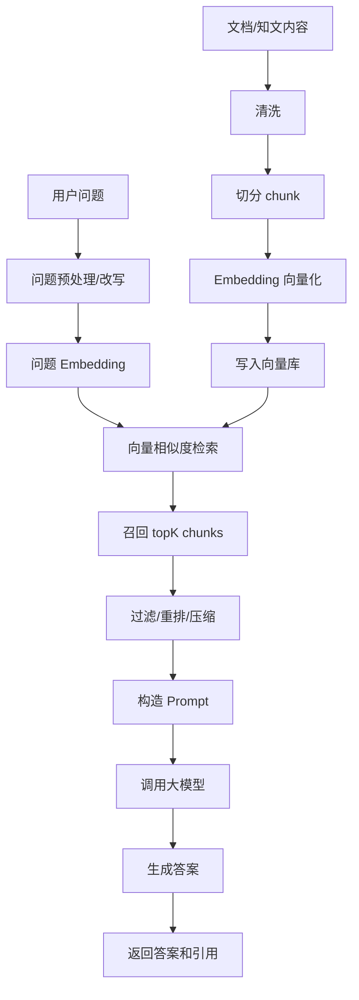
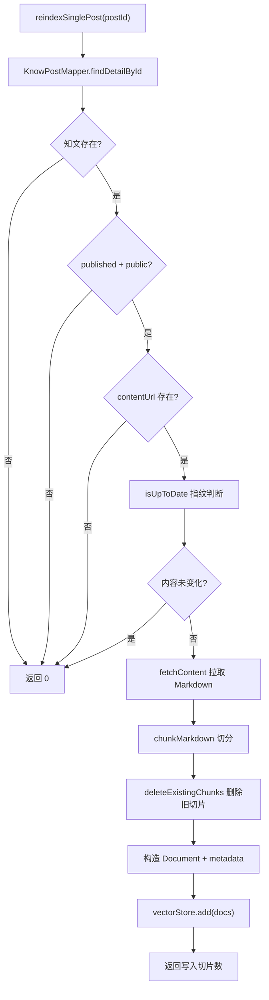
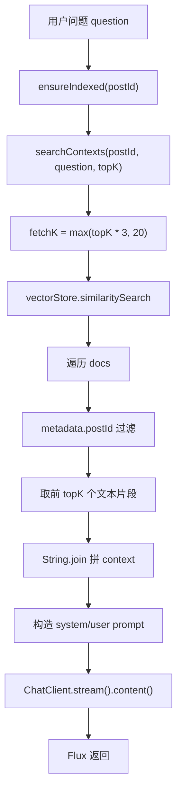

# 09 RAG

> 目标：能完整讲清楚 RAG 从文档进入系统，到用户提问，再到检索、Prompt 构造、模型生成、流式返回的全过程。AI 应用工程师面试中，RAG 是最可能被深挖的项目点。

## 1. 最短面试回答

```text
RAG 是 Retrieval-Augmented Generation，检索增强生成。它不是直接让大模型凭参数记忆回答，而是先从外部知识库检索相关资料，再把资料作为上下文交给模型生成答案。

项目里的 RAG 链路是：用户围绕单篇知文提问，后端先 ensureIndexed 确保知文内容已切片并写入向量库；然后用 VectorStore 做 similaritySearch 召回相关 chunk；按 postId 过滤当前知文片段；把问题和上下文拼成 Prompt；最后用 ChatClient.stream 调模型并通过 SSE 返回 Flux<String>。
```

## 2. 项目源码锚点

- `src/main/java/com/tongji/llm/rag/RagIndexService.java`
  - 索引构建、内容拉取、Markdown 切分、指纹判断、删除旧切片、写入 VectorStore。
- `src/main/java/com/tongji/llm/rag/RagQueryService.java`
  - 提问时索引保障、相似度检索、上下文拼接、Prompt 构造、流式模型调用。
- `src/main/java/com/tongji/knowpost/api/KnowPostRagController.java`
  - `/api/v1/knowposts/{id}/qa/stream`
  - `/api/v1/knowposts/{id}/rag/reindex`
- `src/main/java/com/tongji/config/EsProperties.java`
  - Elasticsearch 向量索引配置。
- `pom.xml`
  - Spring AI VectorStore Elasticsearch。

## 3. RAG 解决什么问题

大模型本身有几个限制：

- 知识截止：不知道训练后发生的新内容。
- 私有知识缺失：不知道你公司内部文档、用户上传内容。
- 幻觉：可能编造看似合理的答案。
- 更新成本高：每次知识变化都微调模型成本太高。
- 可追溯性弱：模型直接回答很难知道依据来自哪里。

RAG 的核心价值：

```text
让模型在回答前先看相关资料，用外部知识增强回答。
```

适合：

- 企业知识库问答。
- 文档问答。
- 论文问答。
- 客服知识库。
- 编程助手。
- 产品手册问答。

## 4. RAG 和微调的区别

| 维度 | RAG | 微调 |
|---|---|---|
| 目标 | 补充外部知识 | 改变模型行为或风格 |
| 更新知识 | 更新索引即可 | 需要重新训练/微调 |
| 成本 | 相对低 | 相对高 |
| 可追溯 | 可返回引用 | 较弱 |
| 适合 | 高频变化、私有知识 | 固定任务、格式、风格 |

面试回答：

```text
如果目标是让模型掌握不断变化的业务知识，我优先选 RAG，因为只要更新知识库和索引即可。如果目标是让模型稳定输出某种格式、风格或专门能力，才考虑微调。
```

## 5. RAG 总链路



项目当前是一个相对朴素但完整的 RAG：

```text
索引：fetch content -> Markdown 分段 -> 固定长度切片 -> VectorStore.add
查询：similaritySearch -> postId 过滤 -> 拼 context -> ChatClient.stream
```

## 6. 项目索引构建链路

入口：

```java
public int reindexSinglePost(long postId)
```

流程：



### 6.1 为什么要只索引 published + public

项目代码：

```java
if (!"published".equalsIgnoreCase(row.getStatus()) || !"public".equalsIgnoreCase(row.getVisible())) {
    return 0;
}
```

原因：

- 草稿不应该被问答检索。
- 私密内容不应该进入公开问答。
- 避免越权和数据泄露。

面试回答：

```text
RAG 知识库不是所有内容都能索引。项目只索引 public 且 published 的知文，避免草稿、私密内容被检索出来造成越权泄露。
```

### 6.2 为什么要做指纹判断

项目：

```java
String currentSha = row.getContentSha256();
String currentEtag = row.getContentEtag();
if (isUpToDate(postId, currentSha, currentEtag)) {
    return 0;
}
```

作用：

- 内容没变就不重复向量化。
- 节省 embedding 成本。
- 避免重复写入。
- 提升首次问答速度。

### 6.3 为什么删除旧切片再写入新切片

项目：

```java
deleteExistingChunks(postId);
vectorStore.add(docs);
```

原因：

- 内容更新后旧 chunk 不能继续参与检索。
- 先删旧版本，再写新版本，保证单一版本。
- 避免同一 postId 多版本 chunk 混在一起。

面试回答：

```text
项目在重建索引前按 postId 删除旧切片，再批量写入新切片，保证向量库里同一篇知文只有一个版本，避免旧内容污染回答。
```

## 7. 文档切分 chunk

项目切分：

```java
private List<String> chunkMarkdown(String text) {
    List<String> paras = new ArrayList<>();
    String[] lines = text.split("\r?\n");
    StringBuilder buf = new StringBuilder();
    for (String line : lines) {
        boolean isHeader = line.startsWith("#");
        if (isHeader && !buf.isEmpty()) {
            paras.add(buf.toString());
            buf.setLength(0);
        }
        buf.append(line).append('\n');
    }
    if (!buf.isEmpty()) paras.add(buf.toString());
    return getChunks(paras);
}
```

再固定长度切片：

```java
if (p.length() <= 800) {
    chunks.add(p);
} else {
    int start = 0;
    while (start < p.length()) {
        int end = Math.min(start + 800, p.length());
        chunks.add(p.substring(start, end));
        if (end >= p.length()) break;
        start = Math.max(end - 100, start + 1);
    }
}
```

### 7.1 为什么要切分

如果整篇文档直接向量化：

- 文本太长，超过 embedding 模型限制。
- 一个向量表达整篇内容，语义太粗。
- 检索出来后上下文太长。
- 模型成本高。

切片好处：

- 检索粒度更细。
- 只把相关片段给模型。
- 控制上下文长度。
- 提高召回准确性。

### 7.2 为什么要 overlap

项目每 800 字符切片，重叠 100 字符。

原因：

- 避免答案刚好跨 chunk 边界被截断。
- 保留上下文连续性。
- 提升检索命中。

面试回答：

```text
chunk 太大检索不精准、上下文成本高；chunk 太小语义不完整。项目按 Markdown 标题先分段，再按 800 字符切片，并设置 100 字符 overlap，避免关键信息被切在边界。
```

## 8. Document 和 metadata

项目构造：

```java
Map<String, Object> meta = new HashMap<>();
meta.put("postId", String.valueOf(postId));
meta.put("chunkId", cid);
meta.put("position", i);
meta.put("contentEtag", currentEtag);
meta.put("contentSha256", currentSha);
meta.put("contentUrl", row.getContentUrl());
meta.put("title", row.getTitle());
docs.add(new Document(chunks.get(i), meta));
```

metadata 的作用：

- 过滤当前 postId。
- 返回引用来源。
- 做版本判断。
- 做排序和展示。
- 删除旧切片。

面试回答：

```text
RAG 不只存文本，还要存 metadata。项目每个 chunk 都保存 postId、chunkId、position、contentSha256、title 等信息，用于过滤当前知文、版本判断和后续引用展示。
```

## 9. 项目查询链路

入口：

```java
public Flux<String> streamAnswerFlux(long postId, String question, int topK, int maxTokens)
```

流程：



## 10. 宽召回和过滤

项目：

```java
int fetchK = Math.max(topK * 3, 20);
List<Document> docs = vectorStore.similaritySearch(
    SearchRequest.builder().query(query).topK(fetchK).build()
);
```

然后：

```java
Object pid = d.getMetadata().get("postId");
if (pid != null && postId.equals(String.valueOf(pid))) {
    out.add(txt);
    if (out.size() >= topK) break;
}
```

为什么 fetchK 大于 topK：

- 向量库先全局召回。
- 再按 postId 过滤。
- 如果只召回 topK，过滤后可能不够。
- 宽召回提高当前知文片段命中概率。

可优化：

```text
更好的方式是在 VectorStore 查询时直接加 metadata filter，而不是先全局召回再 Java 过滤。
```

面试话术：

```text
项目当前先宽召回 fetchK，再按 postId 过滤，避免跨帖子污染。后续可以把 postId 下推到 VectorStore 的 filter expression，减少无关召回和 Java 侧过滤成本。
```

## 11. Prompt 构造

项目：

```java
String context = String.join("\n\n---\n\n", contexts);
String system = "你是中文知识助手。只能依据提供的知文上下文回答；无法确定的请说明不确定。";
String user = "问题：" + question + "\n\n上下文如下（可能不完整）：\n" + context + "\n\n请基于以上上下文作答。";
```

作用：

- system 限定回答边界。
- context 提供检索资料。
- user 放问题。
- `---` 分隔 chunk。

可优化：

- chunk 编号。
- 引用来源。
- context 为空时拒答。
- 指令防注入。
- 输出结构化。

## 12. RAG 质量问题怎么排查

RAG 效果差可能不是模型问题。

排查顺序：

```text
1. 文档是否成功入库？
2. chunk 切分是否合理？
3. embedding 是否成功？
4. 用户问题是否被正确向量化？
5. similaritySearch 召回是否相关？
6. metadata 过滤是否误过滤？
7. topK 是否太小或太大？
8. Prompt 是否清楚？
9. 模型参数是否合适？
10. 输出是否被后处理破坏？
```

面试回答：

```text
我会把 RAG 拆成检索和生成两部分排查。先看召回片段是否正确，如果召回错了，再好的模型也答不好；如果召回正确但回答差，再调整 Prompt、temperature、maxTokens 和输出约束。
```

## 13. RAG 常见优化

### 13.1 Query Rewrite

把用户问题改写成更适合检索的查询。

适合：

- 用户问题很口语。
- 多轮对话中的追问。
- 问题包含指代词。

例子：

```text
用户：那它的优点呢？
改写：RAG 系统相比直接调用大模型的优点是什么？
```

### 13.2 Metadata Filter

按业务字段过滤。

项目场景：

```text
postId == 当前知文 ID
visible == public
status == published
```

### 13.3 Rerank

向量召回后，再用重排模型或规则重新排序。

作用：

- 提高 topK 质量。
- 去掉语义相似但不回答问题的片段。

### 13.4 Hybrid Search

结合：

- 向量检索：语义相似。
- 关键词检索：精确词匹配。

适合：

- 专有名词。
- 编号。
- 代码符号。
- 人名地名。

### 13.5 Context Compression

召回片段太长时压缩。

方式：

- 摘要。
- 抽取相关句子。
- 删除无关段落。

### 13.6 引用来源

回答附带：

```text
依据：[chunkId=123#4]
```

价值：

- 可追溯。
- 降低幻觉感知风险。
- 用户可以核对原文。

## 14. RAG 和项目安全

风险：

- 私密文档被索引。
- 越权检索其他用户内容。
- Prompt Injection。
- 模型输出敏感内容。
- 匿名接口被刷成本。

项目已有：

- 只索引 public + published。
- 查询后按 postId 过滤。
- Prompt 要求只依据上下文。

可补：

- 查询时权限校验。
- metadata filter 下推。
- 登录和限流。
- 敏感词过滤。
- 引用片段展示。

## 15. 高频面试题

### Q1：什么是 RAG？

答：

```text
RAG 是检索增强生成。先从外部知识库检索与用户问题相关的文档片段，再把这些片段作为上下文交给大模型生成答案，从而弥补模型知识过时、私有知识缺失和幻觉问题。
```

### Q2：RAG 完整流程是什么？

答：

```text
离线或准实时阶段：文档清洗、切分、Embedding、写入向量库。在线阶段：用户提问、问题向量化、向量检索 topK、过滤/重排、构造 Prompt、调用模型、返回答案和引用。
```

### Q3：为什么要切分文档？

答：

```text
整篇文档太长且语义太粗，检索不精准，也容易超过上下文窗口。切分后可以只召回相关片段，降低成本并提高回答准确性。
```

### Q4：chunk size 怎么选？

答：

```text
chunk 太大检索不精准且上下文成本高；太小语义不完整。要结合文档结构、模型窗口和任务调试。项目按 Markdown 标题分段，再按约 800 字符切片，100 字符 overlap。
```

### Q5：为什么要 overlap？

答：

```text
overlap 可以避免关键信息被切在两个 chunk 边界，保留上下文连续性，提高召回和回答质量。
```

### Q6：topK 怎么选？

答：

```text
topK 太小可能漏召回，太大可能引入噪声、增加 token 成本。通常从 3 到 8 调试。项目默认 topK=5，并先宽召回再按 postId 过滤。
```

### Q7：RAG 为什么还能胡说？

答：

```text
可能是召回错了、上下文不足、Prompt 约束弱、temperature 过高，或者模型没有严格遵循上下文。要分别优化检索和生成，并要求不确定时拒答。
```

### Q8：RAG 和微调怎么选？

答：

```text
知识频繁变化或私有知识问答优先 RAG；稳定任务格式、风格、特定能力可以考虑微调。实际项目也可以组合使用。
```

### Q9：项目 RAG 链路怎么讲？

答：

```text
用户请求 /qa/stream，RagQueryService 先 ensureIndexed，RagIndexService 读取知文、判断 public/published、按指纹跳过重复索引、Markdown 切分、写入 VectorStore。查询时 similaritySearch 宽召回，再按 postId 过滤，拼 Prompt，最后 ChatClient.stream 流式返回。
```

### Q10：项目 RAG 有什么可优化？

答：

```text
可以把 postId 过滤下推到向量库；给 chunk 编号并返回引用；context 为空时直接拒答；增加相似度阈值和 rerank；对匿名流式接口加限流和用户额度。
```

## 16. 项目讲法

```text
知光项目的 AI 问答是围绕单篇知文做 RAG。索引阶段，系统读取已发布且公开的知文内容，通过 contentSha256/ETag 判断是否需要重建；内容先按 Markdown 标题分段，再按固定长度切片并保留重叠，最后作为 Document 写入 Elasticsearch 向量库，metadata 里保存 postId、chunkId、position、title 和内容指纹。

查询阶段，用户请求 /api/v1/knowposts/{id}/qa/stream，后端先确保该知文已索引，然后用问题做向量相似度检索，宽召回后按 postId 过滤，取 topK 片段拼接成上下文，再构造 system/user prompt，要求模型只能依据上下文回答。最后用 ChatClient.stream 返回 Flux<String>，通过 SSE 给前端流式展示。
```

## 17. 自测清单

- RAG 是什么？
- RAG 解决了大模型哪些问题？
- RAG 和微调区别？
- RAG 离线索引阶段有哪些步骤？
- RAG 在线查询阶段有哪些步骤？
- 为什么要 chunk？
- chunk size 和 overlap 怎么选？
- topK 怎么选？
- metadata 有什么作用？
- 项目为什么只索引 public + published？
- 项目为什么先删旧切片再写新切片？
- 项目为什么先宽召回再按 postId 过滤？
- RAG 效果差怎么排查？
- RAG 有哪些优化方向？

