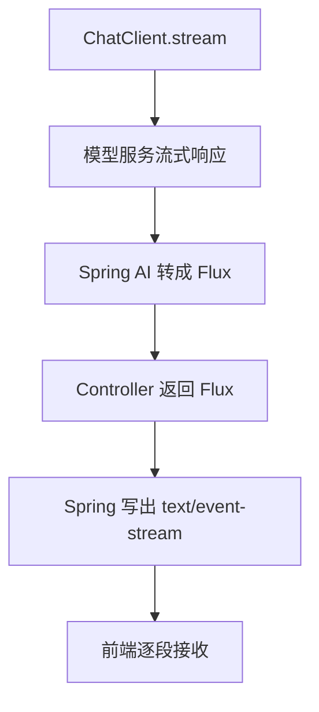

# 11 流式输出

> 目标：能讲清楚为什么 AI 应用需要流式输出，SSE 和 Flux 如何配合，项目中 ChatClient.stream().content() 到前端展示之间的链路，以及流式接口的工程注意事项。

## 1. 最短面试回答

```text
流式输出是指服务端不等完整结果生成完，而是边生成边返回。AI 问答常常需要几秒甚至几十秒，如果一次性返回，用户会一直等待；流式输出能显著改善体验。

项目 RAG 接口用 Spring 的 Flux<String> 表示模型输出流，Controller 设置 produces = text/event-stream，Service 里调用 ChatClient.stream().content()。模型每生成一段内容，后端就通过 SSE 推给前端。
```

## 2. 项目源码锚点

- `src/main/java/com/tongji/knowpost/api/KnowPostRagController.java`
  - `produces = MediaType.TEXT_EVENT_STREAM_VALUE`
  - 返回 `Flux<String>`
- `src/main/java/com/tongji/llm/rag/RagQueryService.java`
  - `chatClient.stream().content()`
- `src/main/java/com/tongji/auth/config/SecurityConfig.java`
  - RAG stream 白名单。

## 3. 为什么 AI 应用需要流式输出

大模型生成有特点：

- 首 token 可能较快。
- 完整回答可能很慢。
- 回答越长等待越久。
- 用户希望看到进度。

普通响应：

```text
用户提问 -> 等 10 秒 -> 一次性显示完整答案
```

流式响应：

```text
用户提问 -> 1 秒后开始显示 -> 持续补全答案
```

价值：

- 降低感知延迟。
- 用户可以提前判断回答是否有用。
- 长文本体验更好。
- 类似 ChatGPT 的输出体验。

## 4. 流式输出不是模型更快

注意：

```text
流式输出通常不减少模型完整生成总时间，它减少的是用户看到第一段内容的时间。
```

指标：

- TTFT：Time To First Token，首 token 时间。
- Total Latency：完整回答时间。
- Tokens per second：生成速度。

面试回答：

```text
流式输出主要优化用户感知延迟，让用户更早看到首段内容，不一定缩短完整生成时间。AI 应用里我会关注首 token 时间、总耗时和输出速度。
```

## 5. SSE 流式接口

项目 Controller：

```java
@GetMapping(value = "/{id}/qa/stream", produces = MediaType.TEXT_EVENT_STREAM_VALUE)
public Flux<String> qaStream(...) {
    return ragQueryService.streamAnswerFlux(id, question, topK, maxTokens);
}
```

关键：

- `produces = text/event-stream`
- 返回 `Flux<String>`
- 浏览器或前端 fetch 接收流。

响应可能类似：

```text
data: 这是

data: 一个

data: 流式

data: 回答

```

## 6. Flux 是什么

`Flux<T>` 来自 Reactor。

含义：

```text
0 到 N 个异步元素的序列。
```

对比：

- `Mono<T>`：0 或 1 个元素。
- `Flux<T>`：0 到多个元素。

项目中：

```java
Flux<String>
```

表示：

```text
模型会产生多段 String，而不是一个完整 String。
```

## 7. ChatClient stream

项目：

```java
return chatClient
        .prompt()
        .system(system)
        .user(user)
        .options(...)
        .stream()
        .content();
```

链路：



## 8. 流式输出和 RAG 的关系

RAG 前半段不是流式：

```text
ensureIndexed -> similaritySearch -> 构造 Prompt
```

模型生成阶段才流式：

```text
ChatClient.stream().content()
```

所以用户首 token 时间包括：

- 索引检查时间。
- 向量检索时间。
- Prompt 构造时间。
- 模型首 token 时间。

优化 TTFT：

- 提前预索引。
- 避免每次都重建索引。
- 检索下推 metadata filter。
- 控制 topK。
- 选择响应更快的模型。

## 9. 前端接收方式

### 9.1 EventSource

```javascript
const es = new EventSource("/api/v1/knowposts/1/qa/stream?question=...");
es.onmessage = (event) => {
  append(event.data);
};
```

优点：

- 浏览器原生。
- 自动重连。
- 简单。

缺点：

- 默认 GET。
- 不方便设置 Authorization Header。
- 长问题放 URL 不优雅。

### 9.2 fetch streaming

```javascript
const response = await fetch("/api/v1/knowposts/1/qa/stream", {
  headers: { Authorization: `Bearer ${token}` }
});
const reader = response.body.getReader();
```

优点：

- 可以用 POST。
- 可以带 Authorization Header。
- 控制更灵活。

缺点：

- 前端处理流更复杂。

## 10. 连接中断

流式请求可能中断：

- 用户关闭页面。
- 网络断开。
- 网关超时。
- 模型服务断开。
- 后端异常。

后端需要：

- 释放资源。
- 记录错误。
- 不继续无意义生成。
- 前端展示“连接已中断”。

如果支持重连：

- 需要会话 ID。
- 需要缓存已生成内容。
- 或重新生成。

第一阶段面试可以简答：

```text
生产中要处理客户端断开、模型超时和网关超时，必要时加心跳和重连机制。
```

## 11. 心跳

SSE 长连接可能被代理认为空闲连接。

可以定期发送注释或 ping：

```text
: ping

```

作用：

- 保持连接活跃。
- 让前端知道服务仍在线。

项目当前未显式心跳，后续可优化。

## 12. 代理缓冲

一些反向代理可能缓冲响应，导致后端明明流式输出，但前端还是等一大段才看到。

需要检查：

- Nginx buffering。
- 网关超时。
- HTTP 压缩。
- CDN 对流式响应支持。

面试回答：

```text
流式接口上线时要确认网关和 Nginx 不会缓冲 text/event-stream，否则后端逐段写出，前端也可能收不到实时片段。
```

## 13. 鉴权问题

项目中 RAG stream：

```java
.requestMatchers(HttpMethod.GET, "/api/v1/knowposts/*/qa/stream").permitAll()
```

学习项目可以降低前端接入难度。

生产风险：

- 被匿名刷接口。
- 模型成本失控。
- 无法做用户额度。

解决：

- 使用 fetch streaming 带 Authorization Header。
- 登录后获取一次性 stream token。
- IP 限流。
- 用户额度。

## 14. 流式输出错误格式

普通 REST API 可以返回：

```json
{"code": "INTERNAL_ERROR", "message": "..."}
```

但流式响应中，可能已经发送了部分内容，再发生错误。

处理方式：

- SSE event 类型区分：

```text
event: error
data: {"message":"模型调用失败"}
```

- 前端监听 error event。
- 后端流中 `onErrorResume` 转换为错误片段。

项目当前可以优化：

```text
为流式回答定义 done/error 事件，而不是裸 Flux<String>。
```

## 15. 背压 Backpressure

响应式流中，背压表示：

```text
消费者处理不过来时，如何告诉生产者慢一点。
```

AI 流式输出中一般第一阶段不用深讲，但可以知道：

- `Flux` 支持响应式流模型。
- 如果前端慢或网络慢，服务端需要处理缓冲和资源占用。

面试简答：

```text
Flux 属于响应式流抽象，理论上支持背压。AI SSE 场景主要关注连接资源、客户端断开和网关缓冲。
```

## 16. 项目可优化点

1. 定义标准 SSE 事件：

```text
event: message
data: ...

event: done
data: {}

event: error
data: {"message":"..."}
```

2. 使用 POST 创建问答任务，GET 订阅流。
3. 支持 fetch streaming，方便携带 Authorization Header。
4. 对匿名流式接口加限流。
5. 加心跳防止连接空闲断开。
6. 记录 TTFT、总耗时、输出 token 数。
7. 处理模型错误并返回可识别错误事件。

## 17. 高频面试题

### Q1：什么是流式输出？

答：

```text
流式输出是不等完整结果生成完，而是服务端边生成边返回。AI 问答里可以降低用户感知等待时间，前端能逐步展示答案。
```

### Q2：流式输出是否让模型生成更快？

答：

```text
不一定。它主要降低首 token 等待时间，让用户更早看到内容；完整生成总时间可能差不多。
```

### Q3：项目怎么实现流式输出？

答：

```text
Controller 设置 produces=text/event-stream 并返回 Flux<String>，Service 调用 ChatClient.stream().content() 获取模型输出流，Spring 将 Flux 写成 SSE 响应给前端。
```

### Q4：SSE 和 WebSocket 怎么选？

答：

```text
AI 问答主要是服务端持续返回文本，SSE 单向推送足够且更简单；如果需要强双向实时交互，比如协同编辑或游戏，再考虑 WebSocket。
```

### Q5：Flux 和 Mono 区别？

答：

```text
Mono 表示 0 或 1 个异步结果，Flux 表示 0 到多个异步结果。模型流式输出会产生多段文本，所以用 Flux<String>。
```

### Q6：流式接口如何处理错误？

答：

```text
如果还没写出响应，可以返回普通错误；如果已经开始流式输出，需要在流中发送 error event 或用 onErrorResume 转换为错误消息，前端也要能识别。
```

### Q7：生产中 SSE 要注意什么？

答：

```text
要注意网关超时、代理缓冲、心跳、客户端断开、鉴权、限流、成本控制和日志观测。
```

### Q8：为什么首 token 时间可能很慢？

答：

```text
首 token 时间包含 RAG 前置处理、检索、Prompt 构造、模型排队和模型首 token 生成。项目中如果 ensureIndexed 每次都重建，就会明显影响 TTFT。
```

### Q9：EventSource 有什么限制？

答：

```text
EventSource 简单但默认 GET，不方便设置 Authorization Header，长问题放 URL 也不优雅。需要鉴权和 POST 时，可以使用 fetch streaming。
```

### Q10：如何优化流式体验？

答：

```text
预索引降低前置耗时，控制 topK 和 maxTokens，选择低延迟模型，加心跳，避免代理缓冲，记录 TTFT，并处理错误事件。
```

## 18. 项目讲法

```text
知光 RAG 问答采用流式输出。用户请求 /qa/stream 后，后端先完成索引检查和向量检索，然后 ChatClient.stream 调用模型，返回 Flux<String>。Controller 声明 text/event-stream，Spring 会把 Flux 中的每段文本持续写给前端。

这样做的原因是大模型回答可能比较长，如果等完整回答生成完再返回，体验会很差。流式输出可以让用户更早看到答案开头。后续我会优化 done/error 事件、心跳、鉴权限流和 TTFT 监控。
```

## 19. 自测清单

- 流式输出是什么？
- 为什么 AI 问答适合流式输出？
- SSE 的 Content-Type 是什么？
- Flux 和 Mono 区别？
- 项目 Controller 如何声明 SSE？
- ChatClient 怎么返回流？
- TTFT 是什么？
- 为什么 RAG 会影响首 token 时间？
- EventSource 和 fetch streaming 区别？
- 流式接口如何处理错误？
- 生产 SSE 要注意哪些问题？
- 项目流式输出有哪些可优化点？

