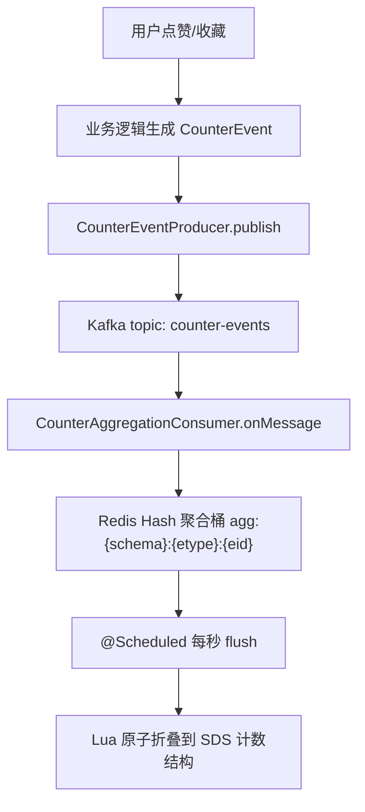
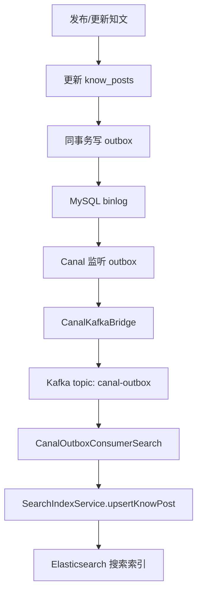

# 14 Kafka

> 目标：能讲清楚 Kafka 是什么、为什么项目要用 Kafka、Producer/Consumer/Topic/Partition/Offset 分别是什么，以及知光项目里 Kafka 如何承接计数事件和 Outbox 事件。重点是先把项目链路讲清楚，不一开始死磕底层源码。

## 1. 最短面试回答

```text
Kafka 是一个分布式消息队列/事件流平台。它把生产者产生的消息保存到 topic 里，消费者按 consumer group 拉取消息并提交 offset。

在项目里 Kafka 主要用于异步解耦和削峰：一类是点赞/收藏等计数事件，业务线程把增量事件发送到 counter-events，消费者先聚合到 Redis，再定时刷写；另一类是 Outbox 事件，业务事务写 outbox 表后，由 Canal 监听 binlog 并转发到 canal-outbox topic，下游消费者异步更新 Elasticsearch 搜索索引。
```

## 2. 项目源码锚点

- `src/main/resources/application.yml`
  - Kafka producer/consumer 配置。
- `src/main/java/com/tongji/counter/config/CounterConfig.java`
  - `@EnableKafka`，创建 `KafkaTemplate<String, String>`。
- `src/main/java/com/tongji/counter/event/CounterEventProducer.java`
  - 生产计数事件到 `counter-events`。
- `src/main/java/com/tongji/counter/event/CounterAggregationConsumer.java`
  - 消费计数事件，写入 Redis 聚合桶，手动 ack。
- `src/main/java/com/tongji/relation/outbox/CanalKafkaBridge.java`
  - Canal 监听 outbox binlog 后转发到 Kafka。
- `src/main/java/com/tongji/search/outbox/CanalOutboxConsumerSearch.java`
  - 消费 `canal-outbox`，更新 Elasticsearch 搜索索引。
- `src/main/java/com/tongji/relation/outbox/OutboxTopics.java`
  - Outbox topic 常量：`canal-outbox`。
- `src/main/java/com/tongji/counter/event/CounterTopics.java`
  - 计数 topic 常量：`counter-events`。

## 3. Kafka 是什么

Kafka 可以先理解成：

```text
一个高吞吐、可持久化、可多消费者订阅的消息系统。
```

业务系统可以把一件事情写成消息：

```json
{
  "entityType": "knowpost",
  "entityId": "123",
  "metric": "like",
  "delta": 1
}
```

然后发送到 Kafka。下游服务再慢慢消费。

它常用于：

- 异步处理。
- 削峰填谷。
- 系统解耦。
- 日志/事件流。
- 数据同步。
- 最终一致性。

## 4. 为什么需要 Kafka

假设用户点赞一篇知文，最朴素的做法是：

```text
请求线程直接更新点赞状态
请求线程直接更新计数
请求线程直接更新作者获赞数
请求线程直接刷新缓存
请求线程直接更新搜索索引
```

这样接口会越来越慢，也越来越容易失败。

Kafka 的作用是把主流程和副作用拆开：

```text
主流程：先完成用户真正关心的操作
副作用：写成消息，交给后台消费者异步处理
```

面试可以这样说：

```text
Kafka 主要解决的是异步解耦和削峰。业务接口不直接执行所有耗时副作用，而是把事件发送到 Kafka，由消费者异步处理。这样可以缩短接口响应时间，也能让下游系统按自己的速度消费。
```

## 5. Kafka 核心概念

### 5.1 Producer

Producer 是消息生产者。

项目里的计数生产者：

```java
@Service
public class CounterEventProducer {
    private final KafkaTemplate<String, String> kafka;
    private final ObjectMapper objectMapper;

    public void publish(CounterEvent event) {
        try {
            String payload = objectMapper.writeValueAsString(event);
            kafka.send(CounterTopics.EVENTS, payload);
        } catch (JsonProcessingException e) {
            // 生产异常不抛出影响主流程；可接入告警
        }
    }
}
```

这里的：

```java
kafka.send(CounterTopics.EVENTS, payload);
```

意思是：

```text
把 payload 发送到 counter-events 这个 topic。
```

### 5.2 Topic

Topic 是消息主题，可以理解成消息分类。

项目有两个典型 topic：

```java
public final class CounterTopics {
    public static final String EVENTS = "counter-events";
}
```

```java
public final class OutboxTopics {
    public static final String CANAL_OUTBOX = "canal-outbox";
}
```

对应含义：

| Topic | 用途 |
|---|---|
| `counter-events` | 点赞、收藏等计数增量事件 |
| `canal-outbox` | Canal 从 outbox 表转发出来的领域事件 |

### 5.3 Broker

Broker 是 Kafka 服务节点。

项目配置：

```yaml
spring:
  kafka:
    bootstrap-servers: localhost:9092
```

`localhost:9092` 就是本地 Kafka broker 地址。

生产环境里通常是多个 broker 组成集群。

### 5.4 Partition

Partition 是 topic 的分区。

可以先这样理解：

```text
一个 topic 可以拆成多个 partition，每个 partition 内部消息有顺序，不同 partition 可以并行消费。
```

第一阶段先记住：

- Kafka 的顺序性通常只保证同一个 partition 内有序。
- 分区越多，并行消费能力越强。
- 如果同一实体的事件必须有序，应该用相同 key 发到同一 partition。

当前项目发送消息时基本没有显式指定 key：

```java
kafka.send(CounterTopics.EVENTS, payload);
```

后续可优化为：

```java
kafka.send(CounterTopics.EVENTS, event.getEntityId(), payload);
```

这样同一篇知文的计数事件更容易进入同一分区。

### 5.5 Consumer

Consumer 是消费者。

项目里的计数消费者：

```java
@KafkaListener(topics = CounterTopics.EVENTS, groupId = "counter-agg")
public void onMessage(String message, Acknowledgment ack) throws Exception {
    CounterEvent evt = objectMapper.readValue(message, CounterEvent.class);
    String aggKey = CounterKeys.aggKey(evt.getEntityType(), evt.getEntityId());
    String field = String.valueOf(evt.getIdx());
    try {
        redis.opsForHash().increment(aggKey, field, evt.getDelta());
        ack.acknowledge();
    } catch (Exception ex) {
        // 不提交位点以便重试
    }
}
```

这里的意思是：

```text
监听 counter-events，消费到消息后写 Redis 聚合桶。
写 Redis 成功后手动 ack。
写 Redis 失败就不 ack，让 Kafka 后续重试。
```

### 5.6 Consumer Group

Consumer Group 是消费者组。

项目里：

```java
@KafkaListener(topics = CounterTopics.EVENTS, groupId = "counter-agg")
```

`counter-agg` 就是消费者组。

规则：

```text
同一个 group 内，消息只会被其中一个消费者实例处理。
不同 group，可以各自独立消费同一份消息。
```

举例：

```text
counter-agg 组消费 counter-events 做计数聚合
audit-log 组也可以消费 counter-events 做审计日志
```

两个组互不影响。

### 5.7 Offset

Offset 是消费者读到 topic 某个位置的进度。

你可以理解成：

```text
我这个消费者组已经处理到第几条消息了。
```

项目配置关闭了自动提交：

```yaml
spring:
  kafka:
    consumer:
      enable-auto-commit: false
    listener:
      ack-mode: manual
```

所以代码里需要手动：

```java
ack.acknowledge();
```

面试回答：

```text
项目关闭了 Kafka 自动提交 offset，使用手动 ack。消费者只有在关键副作用完成后才提交 offset，例如计数事件只有成功写入 Redis 聚合桶后才 ack，这样失败时可以保留消息等待重试。
```

## 6. 项目 Kafka 配置

`application.yml` 中：

```yaml
spring:
  kafka:
    bootstrap-servers: localhost:9092
    template:
      default-topic: counter-events
    producer:
      key-serializer: org.apache.kafka.common.serialization.StringSerializer
      value-serializer: org.apache.kafka.common.serialization.StringSerializer
      acks: all
      retries: 3
      linger: 10ms
      properties:
        enable.idempotence: true
        max.in.flight.requests.per.connection: 1
    consumer:
      group-id: counter-agg
      key-deserializer: org.apache.kafka.common.serialization.StringDeserializer
      value-deserializer: org.apache.kafka.common.serialization.StringDeserializer
      auto-offset-reset: latest
      enable-auto-commit: false
    listener:
      type: single
      ack-mode: manual
```

重点解释：

| 配置 | 含义 |
|---|---|
| `bootstrap-servers` | Kafka broker 地址 |
| `StringSerializer` | key/value 都按字符串序列化 |
| `acks: all` | leader 和副本确认后才算写入成功 |
| `retries: 3` | 生产端失败重试 |
| `enable.idempotence: true` | 开启幂等生产，减少重复写入 |
| `enable-auto-commit: false` | 不自动提交消费进度 |
| `ack-mode: manual` | 业务代码手动 ack |

## 7. 项目链路一：计数事件

点赞/收藏计数适合 Kafka，因为它是高频写场景。

如果每次点赞都直接更新最终计数：

```text
高并发下大量写同一个计数 key 或数据库行
容易造成热点和性能问题
```

项目做法：



生产者：

```java
String payload = objectMapper.writeValueAsString(event);
kafka.send(CounterTopics.EVENTS, payload);
```

消费者：

```java
CounterEvent evt = objectMapper.readValue(message, CounterEvent.class);
String aggKey = CounterKeys.aggKey(evt.getEntityType(), evt.getEntityId());
String field = String.valueOf(evt.getIdx());

redis.opsForHash().increment(aggKey, field, evt.getDelta());
ack.acknowledge();
```

这里为什么写 Redis 聚合桶，而不是直接写最终计数？

```text
因为高频增量可以先聚合，定时批量折叠，减少最终计数结构的写压力。
```

## 8. 项目链路二：Outbox 事件

Outbox 链路是你刚理解的重点。



业务写 Outbox：

```java
long outId = idGen.nextId();
String payload = objectMapper.writeValueAsString(
        Map.of("entity", "knowpost", "op", "upsert", "id", id)
);
outboxMapper.insert(outId, "knowpost", id, "KnowPostPublished", payload);
```

Canal 桥接到 Kafka：

```java
if ("payload".equalsIgnoreCase(col.getName())) {
    rowNode.put("payload", col.getValue());
}

String json = objectMapper.writeValueAsString(msgNode);
kafka.send(OutboxTopics.CANAL_OUTBOX, json);
```

搜索消费者：

```java
JsonNode payload = objectMapper.readTree(payloadNode.asText());
String entity = text(payload.get("entity"));
String op = text(payload.get("op"));
Long id = asLong(payload.get("id"));

if (!"knowpost".equals(entity) || id == null) {
    continue;
}

if ("delete".equalsIgnoreCase(op)) {
    indexService.softDeleteKnowPost(id);
} else {
    indexService.upsertKnowPost(id);
}
```

这里 Kafka 的作用：

```text
把 MySQL 的 outbox 事件异步分发给搜索索引消费者。
```

## 9. Kafka 和 Outbox 的关系

Kafka 解决消息分发问题。

Outbox 解决业务数据和消息记录的一致性问题。

两者经常一起用：

```text
业务事务内：写主表 + 写 outbox
事务提交后：Canal/扫描器把 outbox 投递到 Kafka
下游系统：消费 Kafka 更新自己的数据
```

为什么不直接在业务代码里发 Kafka？

```java
mapper.publish(id, creatorId);
kafka.send("canal-outbox", payload);
```

问题：

```text
MySQL 成功，Kafka 失败，事件丢了。
Kafka 成功，MySQL 回滚，下游看到不存在的业务事实。
```

Outbox 的优势：

```text
业务事实和事件记录都先写进同一个 MySQL 事务，之后再异步投递 Kafka。
```

## 10. 可靠性：至少一次、最多一次、恰好一次

第一阶段不用深挖数学定义，先会解释。

### 10.1 最多一次

```text
消息可能丢，但不会重复。
```

例子：

```text
消费者先提交 offset，再处理业务。
如果提交后处理失败，这条消息不会再来了。
```

### 10.2 至少一次

```text
消息不容易丢，但可能重复。
```

例子：

```text
消费者先处理业务，成功后再提交 offset。
如果处理成功但提交 offset 前宕机，消息会再次消费。
```

项目更接近这个方向：

```java
redis.opsForHash().increment(aggKey, field, evt.getDelta());
ack.acknowledge();
```

但是重复消费会带来重复加算风险，所以业务侧要考虑幂等。

### 10.3 恰好一次

```text
既不丢也不重复。
```

这个要求最高，通常需要 Kafka 事务、幂等生产、幂等消费、外部存储配合。面试第一阶段可以说：

```text
工程上更常见的是至少一次投递 + 消费端幂等，避免追求绝对恰好一次带来过高复杂度。
```

## 11. 当前项目的可靠性提醒

### 11.1 Producer 没有等待发送结果

计数生产者：

```java
kafka.send(CounterTopics.EVENTS, payload);
```

Outbox 桥接：

```java
kafka.send(OutboxTopics.CANAL_OUTBOX, json);
```

`send` 是异步的。如果不等待结果，可能出现：

```text
发送实际失败了，但业务代码不知道。
```

优化方向：

```text
监听 Kafka send result，成功后再确认上游位点；失败则记录日志、重试或告警。
```

### 11.2 Canal ack 时机需要更严谨

当前桥接器在循环末尾：

```java
connector.ack(batchId);
```

如果 Kafka 发送失败但仍然 ack Canal 位点：

```text
Canal 认为这批 binlog 已处理
Kafka 实际没收到
下游 ES 不会更新
```

优化方向：

```text
等待本批 Kafka 发送全部成功后，再 ack Canal batchId。
```

### 11.3 Consumer 不应该吞掉关键异常

搜索消费者最后会：

```java
ack.acknowledge();
```

但 `SearchIndexService` 内部 ES 写失败时只是日志：

```java
catch (Exception e) {
    log.error("Index upsert failed for post {}: {}", id, e.getMessage());
}
```

这样会导致：

```text
ES 更新失败，但 Kafka offset 已提交，消息不会自动重试。
```

优化方向：

```text
ES 写失败时抛出异常，消费者不 ack；或者接入重试 topic / 死信队列。
```

## 12. Kafka 和 Redis 队列的区别

| 维度 | Kafka | Redis List/Stream |
|---|---|---|
| 定位 | 分布式事件流/消息系统 | Redis 数据结构提供队列能力 |
| 吞吐 | 很高，适合大规模日志/事件 | 中小规模更轻量 |
| 消息持久化 | 以日志形式持久化 | 取决于 Redis 持久化配置 |
| 多消费者组 | 天然支持 | Stream 支持，List 较弱 |
| 回放消息 | 支持按 offset 回放 | Stream 支持，List 不适合 |
| 运维复杂度 | 较高 | 较低 |

面试回答：

```text
Redis 更适合轻量、临时、低复杂度队列；Kafka 更适合高吞吐、可持久化、可回放、多消费者订阅的事件流场景。
```

## 13. Kafka 和 RabbitMQ 的区别

第一阶段简单掌握即可：

| 维度 | Kafka | RabbitMQ |
|---|---|---|
| 模型 | 日志型消息流 | 传统消息队列 |
| 重点 | 高吞吐、持久化、回放 | 路由灵活、任务分发 |
| 消息保留 | 消费后仍可保留一段时间 | 通常 ack 后删除 |
| 典型场景 | 日志、事件流、数据同步 | 任务队列、业务消息 |

面试回答：

```text
Kafka 更像可持久化的事件日志，适合高吞吐和多消费者回放；RabbitMQ 更像传统消息队列，路由模型更灵活，适合任务分发和复杂路由。
```

## 14. 高频面试题

### 14.1 Kafka 为什么高吞吐

```text
Kafka 高吞吐主要因为顺序写磁盘、批量发送、零拷贝、分区并行、页缓存利用充分。第一阶段回答到这些关键词即可。
```

### 14.2 Kafka 如何保证消息不丢

从三端回答：

Producer：

```text
acks=all、retries、enable.idempotence。
```

Broker：

```text
副本机制、合理配置 min.insync.replicas。
```

Consumer：

```text
关闭自动提交，业务处理成功后手动提交 offset。
```

结合项目：

```text
项目里 producer 配了 acks=all、retries=3、enable.idempotence=true；consumer 关闭自动提交，使用 manual ack。
```

### 14.3 Kafka 会不会重复消费

会。

常见情况：

```text
业务处理成功，但 offset 还没提交，消费者宕机。
重启后会从旧 offset 再消费一次。
```

解决方向：

```text
消费端幂等，例如用唯一事件 ID 去重，或者写操作天然可覆盖。
```

### 14.4 什么是消费积压

消费积压就是：

```text
生产速度 > 消费速度，topic 中未消费消息越来越多。
```

排查方向：

- 消费者是否报错。
- 下游 Redis/ES/MySQL 是否慢。
- partition 是否太少。
- consumer 实例数是否不足。
- 单条消息处理是否太重。

### 14.5 auto-offset-reset=latest 是什么

项目配置：

```yaml
auto-offset-reset: latest
```

含义：

```text
当消费者组没有已提交 offset 时，从最新消息开始消费，不从历史最早消息开始。
```

如果要从头消费历史消息，可以用：

```yaml
auto-offset-reset: earliest
```

## 15. 项目可优化点

### 15.1 Outbox 写入异常不要吞

当前知文发布里：

```java
try {
    outboxMapper.insert(...);
} catch (Exception e) {
    log.warn(...);
}
```

风险：

```text
知文发布成功，但 outbox 事件没写进去，ES 永远不知道要更新。
```

优化：

```text
Outbox 写失败应让事务回滚，保证业务状态和事件记录同生共死。
```

### 15.2 Canal 发 Kafka 后等待发送结果

当前：

```java
kafka.send(OutboxTopics.CANAL_OUTBOX, json);
connector.ack(batchId);
```

优化：

```text
等待 Kafka send 成功后再 ack Canal。失败则不 ack，让 Canal 后续重拉。
```

### 15.3 ES 更新失败不要提交 Kafka offset

当前搜索索引写失败只打日志。

优化：

```text
SearchIndexService 写 ES 失败时抛异常，Consumer 不 ack；超过重试次数后进入死信队列。
```

### 15.4 给消息加 key

当前很多发送：

```java
kafka.send(topic, payload);
```

优化：

```java
kafka.send(topic, String.valueOf(entityId), payload);
```

好处：

```text
同一实体的消息更容易进入同一 partition，便于保持局部顺序。
```

## 16. 学习路线

第一轮：概念能讲清楚。

- Producer
- Consumer
- Topic
- Partition
- Consumer Group
- Offset
- Ack

第二轮：结合项目讲链路。

- `counter-events` 计数聚合。
- `canal-outbox` 搜索索引同步。
- 为什么 Kafka 适合异步副作用。
- 为什么 Outbox 要和 Kafka 一起用。

第三轮：能讲优化。

- Outbox 写失败要回滚。
- Kafka send 失败不能 ack Canal。
- ES 写失败不能提交 Kafka offset。
- 消费端要考虑幂等和重试。

## 17. 面试 1 分钟回答模板

```text
项目里 Kafka 主要用于异步事件处理。一条链路是计数系统，点赞收藏这类高频事件先由业务线程发送到 counter-events，消费者写入 Redis 聚合桶，再定时折叠到最终计数结构，避免高并发下直接频繁更新计数。

另一条链路是 Outbox。知文发布或元数据更新时，业务事务会同时更新 know_posts 和 outbox 表。Canal 监听 outbox 的 binlog，把 payload 转发到 Kafka 的 canal-outbox topic，搜索消费者拿到 id 后回查 MySQL 组装 ES 文档并写入 Elasticsearch。

我理解 Kafka 在这里的作用是异步解耦、削峰和支撑最终一致性。后续我会优化可靠性，比如 Outbox 写入失败回滚事务，Kafka 发送成功后再 ack Canal，ES 更新失败不提交 Kafka offset，并引入重试或死信队列。
```

