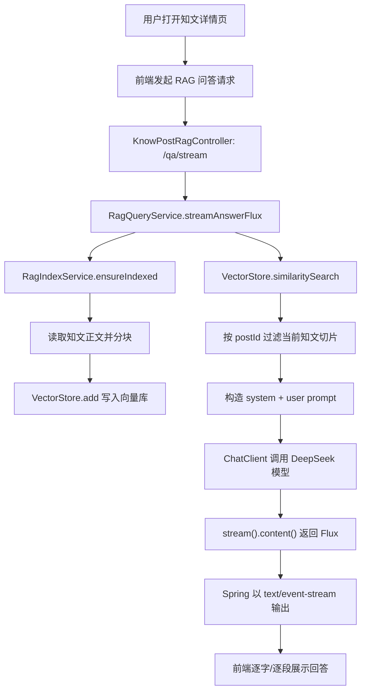

# P0 面试复习总目录

> 目标：这组文档服务于第一阶段海投和一面准备。优先让你能把简历上的项目讲清楚，并能回答 AI 应用工程师实习最常见的技术追问。

## 使用方式

建议按编号学习，不要一开始跳到最难的 RAG 和 MCP。

第一轮目标是“能复述”：

1. 看每篇的“最短面试回答”。
2. 看“项目源码锚点”，知道这个知识点在本项目哪里落地。
3. 背“高频面试题”里的标准答法。
4. 用自己的话录一遍 1 分钟讲解。

第二轮目标是“能追问”：

1. 看“深入理解”部分。
2. 对每个问题补充项目里的例子。
3. 遇到不会的点，回到对应源码读 20 行上下文。

第三轮目标是“能优化”：

1. 看“项目可优化点”。
2. 选 1-2 个真实改造点写进简历或面试话术。
3. 准备“如果重做你会怎么设计”的回答。

## 文档清单

| 编号 | 文档 | 面试价值 |
|---|---|---|
| 01 | [Java 基础](./01-Java基础.md) | Java 后端实习基础盘，集合、异常、并发、JVM 入门 |
| 02 | [Spring Boot 与 Spring MVC](./02-SpringBoot与SpringMVC.md) | 请求链路、IOC、AOP、Controller/Service 分层 |
| 03 | [MyBatis 与 MySQL](./03-MyBatis与MySQL.md) | Mapper、SQL、索引、事务、唯一索引并发兜底 |
| 04 | [Redis](./04-Redis.md) | TTL、验证码、refresh token、缓存与高频八股 |
| 05 | [JWT 与 Spring Security](./05-JWT与SpringSecurity.md) | 认证模块核心，过滤链、Bearer JWT、无状态鉴权 |
| 06 | [HTTP、RESTful 与 SSE](./06-HTTP_RESTful_SSE.md) | Web 基础、接口设计、流式响应协议 |
| 07 | [大模型 API 调用](./07-大模型API调用.md) | AI 应用工程师必备，模型参数、错误处理、成本 |
| 08 | [Prompt Engineering](./08-PromptEngineering.md) | 提示词结构、约束、上下文、反注入 |
| 09 | [RAG](./09-RAG.md) | AI 项目最核心追问：检索增强生成全链路 |
| 10 | [Embedding 与向量检索](./10-Embedding与向量检索.md) | RAG 底座，向量、相似度、topK、召回优化 |
| 11 | [流式输出](./11-流式输出.md) | SSE/WebFlux/Flux，AI 回答体验与工程实现 |
| 12 | [Tool Calling 与 MCP](./12-ToolCalling与MCP.md) | AI 应用进阶，工具调用、MCP、权限与安全 |
| 13 | [算法第一阶段](./13-算法第一阶段.md) | 实习面试算法基本盘，高频题型和模板 |
| 14 | [Kafka](./14-Kafka.md) | 异步消息、计数聚合、Outbox、Canal、搜索索引同步 |

## 项目源码地图

认证模块：

- `src/main/java/com/tongji/auth/api/AuthController.java`
- `src/main/java/com/tongji/auth/service/AuthService.java`
- `src/main/java/com/tongji/auth/config/SecurityConfig.java`
- `src/main/java/com/tongji/auth/config/AuthConfiguration.java`
- `src/main/java/com/tongji/auth/token/JwtService.java`
- `src/main/java/com/tongji/auth/token/RedisRefreshTokenStore.java`
- `src/main/java/com/tongji/auth/verification/VerificationService.java`
- `src/main/java/com/tongji/auth/verification/RedisVerificationCodeStore.java`

用户与数据库：

- `src/main/java/com/tongji/user/mapper/UserMapper.java`
- `src/main/resources/mapper/UserMapper.xml`
- `src/main/java/com/tongji/user/service/impl/UserServiceImpl.java`
- `db/schema.sql`

AI/RAG：

- `src/main/java/com/tongji/llm/LlmConfig.java`
- `src/main/java/com/tongji/llm/service/impl/KnowPostDescriptionServiceImpl.java`
- `src/main/java/com/tongji/llm/rag/RagIndexService.java`
- `src/main/java/com/tongji/llm/rag/RagQueryService.java`
- `src/main/java/com/tongji/knowpost/api/KnowPostRagController.java`

Web 与流式接口：

- `src/main/java/com/tongji/knowpost/api/KnowPostRagController.java`
- `src/main/java/com/tongji/auth/config/SecurityConfig.java`

## 第一阶段总链路



## 面试优先级

P0 必须能讲清楚：

- JWT 鉴权链路。
- Spring Security 过滤链和白名单。
- Redis TTL 为什么适合验证码和 refresh token。
- MySQL 唯一索引如何解决并发注册。
- HTTP 请求响应和 RESTful 资源设计。
- SSE 为什么适合 AI 流式回答。
- 大模型 API 调用参数：model、messages、temperature、max_tokens、stream。
- Prompt 如何约束模型。
- RAG 从文档切分到向量检索再到生成的全过程。
- Embedding 和向量检索的关系。
- Tool Calling 和 MCP 的基本区别。

P1 可以简略回答：

- Canal、Elasticsearch 搜索、Caffeine、本地缓存、Docker 部署。

P2 第一阶段暂时不要死磕：

- Transformer 数学推导。
- 大模型训练、微调、分布式训练。
- CUDA、推理引擎底层优化。

## 面试自我介绍模板

```text
我目前主要投 AI 应用工程师实习。我的优势不是训练大模型，而是把大模型能力接入真实业务系统。

我做过 AI 编程学习辅助系统，也在知光项目里重点学习和梳理了 RAG 知识问答链路。这个链路包括知文内容索引、Markdown 分块、Embedding 写入向量库、相似度检索、Prompt 构造、大模型调用和 SSE 流式返回。

同时我有 Java Spring Boot 后端基础，能做认证鉴权、接口开发、MySQL 持久化、Redis 缓存和 JWT 无状态会话管理。所以我更适合大模型应用落地方向，比如知识库问答、企业助手、编程学习助手这类业务。
```

## 参考资料

- Java SE 21 API: https://docs.oracle.com/en/java/javase/21/docs/api/index.html
- Spring Boot Docs: https://docs.spring.io/spring-boot/index.html
- Spring Framework Web MVC: https://docs.spring.io/spring-framework/reference/web/webmvc.html
- Spring Security Architecture: https://docs.spring.io/spring-security/reference/servlet/architecture.html
- Spring Security Resource Server JWT: https://docs.spring.io/spring-security/reference/servlet/oauth2/resource-server/jwt.html
- MyBatis Mapper XML: https://mybatis.org/mybatis-3/sqlmap-xml.html
- MySQL InnoDB Indexes: https://dev.mysql.com/doc/refman/8.4/en/innodb-index-types.html
- Redis Data Types: https://redis.io/docs/latest/develop/data-types/
- Redis EXPIRE: https://redis.io/docs/latest/commands/expire/
- JWT RFC 7519: https://www.rfc-editor.org/rfc/rfc7519
- MDN HTTP Overview: https://developer.mozilla.org/en-US/docs/Web/HTTP/Guides/Overview
- MDN Server-Sent Events: https://developer.mozilla.org/en-US/docs/Web/API/Server-sent_events/Using_server-sent_events
- OpenAI Text Generation: https://developers.openai.com/api/docs/guides/text
- OpenAI Prompt Engineering: https://developers.openai.com/api/docs/guides/prompt-engineering
- OpenAI Embeddings: https://developers.openai.com/api/docs/guides/embeddings
- OpenAI Retrieval: https://developers.openai.com/api/docs/guides/retrieval
- OpenAI Function Calling: https://developers.openai.com/api/docs/guides/function-calling
- Spring AI Chat Client: https://docs.spring.io/spring-ai/reference/api/chatclient.html
- Spring AI RAG: https://docs.spring.io/spring-ai/reference/api/retrieval-augmented-generation.html
- Spring AI Vector Databases: https://docs.spring.io/spring-ai/reference/api/vectordbs.html
- MCP Introduction: https://modelcontextprotocol.io/docs/getting-started/intro
