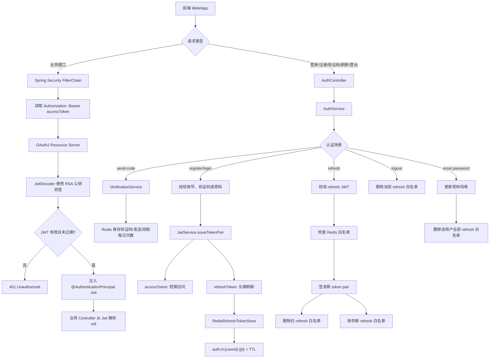

# 知光认证模块学习与面试总结

> 目标：这一份文档既能帮助从 0 读懂本项目认证模块，也能覆盖面试中常见的 JWT、Spring Security、OAuth2 Resource Server、Redis TTL、BCrypt、CSRF、Session 等八股问题。

## 0. 先记住一句总述

知光认证模块采用 **Spring Security + OAuth2 Resource Server + JWT 双令牌 + Redis 白名单** 的方案。

用户注册或登录成功后，服务端签发短期 `accessToken` 和长期 `refreshToken`。普通业务接口使用 `accessToken` 做无状态鉴权；`refreshToken` 的 `jti` 会存入 Redis 白名单，用于刷新令牌、登出撤销和重置密码强制下线。密码使用 BCrypt 哈希存储，验证码和 refresh token 白名单都依赖 Redis TTL 管理生命周期。

面试时可以浓缩成：

> 登录成功后签发 access/refresh 双令牌。access token 用于无状态访问接口，refresh token 用 Redis 白名单增强可撤销能力。接口鉴权由 Spring Security Resource Server 自动解析 Bearer JWT、验签、校验过期时间，并通过 `@AuthenticationPrincipal Jwt` 注入当前用户身份。

## 1. 相关源码地图

### 1.1 核心文件

| 文件 | 作用 |
| --- | --- |
| `src/main/java/com/tongji/auth/config/SecurityConfig.java` | Spring Security 过滤链、白名单、CORS、CSRF、无状态 Session、Resource Server JWT 接入 |
| `src/main/java/com/tongji/auth/config/AuthConfiguration.java` | 创建 `PasswordEncoder`、`JwtEncoder`、`JwtDecoder` |
| `src/main/java/com/tongji/auth/config/AuthProperties.java` | 绑定 `auth.*` 配置，如 token TTL、验证码策略、BCrypt 强度 |
| `src/main/java/com/tongji/auth/api/AuthController.java` | 认证 API 入口：验证码、注册、登录、刷新、登出、重置密码、当前用户 |
| `src/main/java/com/tongji/auth/service/AuthService.java` | 认证业务编排核心 |
| `src/main/java/com/tongji/auth/token/JwtService.java` | 签发、解析 JWT，提取 `uid`、`token_type`、`jti` |
| `src/main/java/com/tongji/auth/token/RedisRefreshTokenStore.java` | Redis refresh token 白名单 |
| `src/main/java/com/tongji/auth/verification/VerificationService.java` | 验证码发送、限流、日限额 |
| `src/main/java/com/tongji/auth/verification/RedisVerificationCodeStore.java` | Redis 验证码存储、校验、尝试次数 |
| `src/main/java/com/tongji/auth/audit/LoginLogService.java` | 登录/注册审计日志 |

### 1.2 配置文件

配置位于 `src/main/resources/application.yml`：

```yaml
auth:
  jwt:
    issuer: zhiguang
    key-id: zhiguang-key
    private-key: classpath:keys/private.pem
    public-key: classpath:keys/public.pem
    access-token-ttl: PT15M
    refresh-token-ttl: P7D
  verification:
    code-length: 6
    ttl: PT5M
    max-attempts: 5
    send-interval: PT60S
    daily-limit: 10
  password:
    bcrypt-strength: 12
    min-length: 8
```

含义：

| 配置 | 含义 |
| --- | --- |
| `access-token-ttl: PT15M` | access token 有效期 15 分钟 |
| `refresh-token-ttl: P7D` | refresh token 有效期 7 天 |
| `private-key` | RSA 私钥，用于签发 JWT |
| `public-key` | RSA 公钥，用于校验 JWT |
| `verification.ttl: PT5M` | 验证码 5 分钟过期 |
| `send-interval: PT60S` | 同一标识 60 秒内不能重复发送 |
| `daily-limit: 10` | 同一标识每日最多发送 10 次 |
| `bcrypt-strength: 12` | BCrypt cost，数值越大计算越慢 |

## 2. 整体架构图



## 3. 接口与核心链路

### 3.1 发送验证码

接口：

```http
POST /api/v1/auth/send-code
```

调用链：

```text
AuthController.sendCode
  -> AuthService.sendCode
  -> VerificationService.sendCode
  -> RedisVerificationCodeStore.saveCode
  -> CodeSender.sendCode
```

核心逻辑：

1. 校验手机号或邮箱格式。
2. 根据场景判断账号是否应该存在：
   - 注册：账号不能已存在。
   - 登录/重置密码：账号必须已存在。
3. 检查发送频率：
   - `auth:code:last:{scene}:{identifier}` 控制 60 秒间隔。
   - `auth:code:count:{scene}:{identifier}:{yyyyMMdd}` 控制每日次数。
4. 生成 6 位数字验证码。
5. Redis Hash 保存验证码、最大尝试次数、当前尝试次数，并设置 TTL。
6. 开发环境使用 `LoggingCodeSender` 输出日志，不真正发送短信/邮件。

Redis key：

```text
auth:code:{scene}:{identifier}
auth:code:last:{scene}:{identifier}
auth:code:count:{scene}:{identifier}:{yyyyMMdd}
```

为什么适合 Redis：

- 验证码是短生命周期数据。
- 读写频繁，不需要长期持久化。
- TTL 到期自动失效。
- Redis 原子自增适合做发送次数限制。

### 3.2 注册

接口：

```http
POST /api/v1/auth/register
```

调用链：

```text
AuthController.register
  -> AuthService.register
  -> VerificationService.verify
  -> UserService.createUser
  -> JwtService.issueTokenPair
  -> RefreshTokenStore.storeToken
  -> LoginLogService.record
```

核心步骤：

1. 检查是否同意协议。
2. 校验手机号/邮箱格式。
3. 校验账号不存在。
4. 校验验证码。
5. 创建用户，默认生成昵称、头像、标签等信息。
6. 如果传入密码，校验密码强度后用 BCrypt 哈希。
7. 签发 access token 和 refresh token。
8. 将 refresh token 的 `jti` 存入 Redis 白名单。
9. 记录注册审计日志。

关键点：

- 注册成功后自动登录。
- 用户密码不存明文，只存 BCrypt 后的哈希。
- refresh token 不是只靠 JWT 自身有效，还必须存在于 Redis 白名单。

### 3.3 登录

接口：

```http
POST /api/v1/auth/login
```

支持两种方式：

- 密码登录：提交 `password`。
- 验证码登录：提交 `code`。

调用链：

```text
AuthController.login
  -> AuthService.login
  -> UserService.findByPhone/findByEmail
  -> PasswordEncoder.matches 或 VerificationService.verify
  -> JwtService.issueTokenPair
  -> RefreshTokenStore.storeToken
  -> LoginLogService.record
```

密码登录重点：

```text
前端提交明文密码
  -> 后端查询用户 passwordHash
  -> BCryptPasswordEncoder.matches(raw, hash)
  -> 匹配成功才签发 token
```

验证码登录重点：

```text
前端提交 code
  -> Redis 查询验证码
  -> 检查是否过期、错误、尝试超限
  -> 成功后删除验证码，防止重复使用
```

### 3.4 访问受保护接口

请求格式：

```http
GET /api/v1/auth/me
Authorization: Bearer <accessToken>
```

链路：

```text
请求进入后端
  -> Spring Security FilterChain
  -> 判断是否白名单
  -> 非白名单，要求 authenticated()
  -> OAuth2 Resource Server 提取 Bearer token
  -> JwtDecoder 使用公钥验签
  -> 校验 exp
  -> 构造 Authentication
  -> Controller 通过 @AuthenticationPrincipal Jwt 获取用户
  -> JwtService.extractUserId(jwt)
```

核心代码点：

```java
@GetMapping("/me")
public AuthUserResponse me(@AuthenticationPrincipal Jwt jwt) {
    long userId = jwtService.extractUserId(jwt);
    return authService.me(userId);
}
```

这体现了一个重要安全原则：

> 业务接口不要相信前端传入的 `userId`，而要从已经验签的 JWT 中解析当前用户身份。

### 3.5 刷新令牌

接口：

```http
POST /api/v1/auth/token/refresh
```

请求体：

```json
{
  "refreshToken": "<refreshToken>"
}
```

调用链：

```text
AuthController.refresh
  -> AuthService.refresh
  -> JwtService.decode
  -> JwtService.extractTokenType
  -> JwtService.extractUserId
  -> JwtService.extractTokenId
  -> RefreshTokenStore.isTokenValid
  -> JwtService.issueTokenPair
  -> RefreshTokenStore.revokeToken
  -> RefreshTokenStore.storeToken
```

刷新流程：

```text
解析 refreshToken
  -> 检查 token_type == refresh
  -> 提取 uid 和 jti
  -> 查询 Redis: auth:rt:{uid}:{jti}
  -> Redis 存在才允许刷新
  -> 签发新的 accessToken + refreshToken
  -> 删除旧 refreshToken 白名单
  -> 保存新 refreshToken 白名单
```

这个策略叫 **Refresh Token Rotation**，即刷新令牌轮换。

价值：

- refresh token 被盗后，旧 token 在刷新后会失效。
- 服务端可以通过删除 Redis 白名单撤销 refresh token。
- 密码重置、登出等场景可以主动切断续期能力。

### 3.6 登出

接口：

```http
POST /api/v1/auth/logout
```

请求体：

```json
{
  "refreshToken": "<refreshToken>"
}
```

核心逻辑：

```text
解析 refresh token
  -> 如果是合法 refresh token
  -> 提取 uid 和 jti
  -> 删除 Redis 白名单
```

注意：

当前登出只撤销 refresh token。access token 是无状态 JWT，在 15 分钟过期前理论上仍可访问业务接口。

这不是实现错误，而是 JWT 无状态方案常见取舍。

如果业务需要登出后 access token 立即失效，可以考虑：

1. access token 黑名单。
2. 用户表维护 `tokenVersion`，JWT 中携带版本号，每次鉴权比对版本。
3. 缩短 access token TTL。

### 3.7 重置密码

接口：

```http
POST /api/v1/auth/password/reset
```

核心逻辑：

```text
校验手机号/邮箱格式
  -> 校验新密码复杂度
  -> 查询用户
  -> 校验验证码
  -> BCrypt 哈希新密码
  -> 更新数据库
  -> revokeAll(userId)，删除该用户所有 refresh token
```

价值：

密码重置后，所有设备都不能继续用旧 refresh token 续期，相当于强制下线。

## 4. JWT 八股与项目落地

### 4.1 JWT 是什么

JWT 全称 JSON Web Token，是一种紧凑的、带签名的声明格式。

结构：

```text
Header.Payload.Signature
```

例如：

```text
eyJhbGciOiJSUzI1NiJ9.eyJzdWIiOiIxMDAxIn0.signature
```

### 4.2 Header

Header 描述 token 类型和签名算法。

常见字段：

```json
{
  "alg": "RS256",
  "typ": "JWT",
  "kid": "zhiguang-key"
}
```

本项目通过 `AuthConfiguration` 创建 RSA JWK，并设置 `keyID`。

### 4.3 Payload / Claims

Payload 保存声明，也叫 Claims。

本项目 access token 主要包含：

| Claim | 含义 |
| --- | --- |
| `iss` | 签发者，`zhiguang` |
| `iat` | 签发时间 |
| `exp` | 过期时间 |
| `sub` | 主体，这里是用户 ID |
| `jti` | token 唯一 ID |
| `token_type` | `access` |
| `uid` | 用户 ID |
| `nickname` | 用户昵称 |

refresh token 主要包含：

| Claim | 含义 |
| --- | --- |
| `iss` | 签发者 |
| `iat` | 签发时间 |
| `exp` | 过期时间 |
| `sub` | 用户 ID |
| `jti` | refresh token ID |
| `token_type` | `refresh` |
| `uid` | 用户 ID |

注意：

JWT Payload 只是 Base64URL 编码，不是加密。任何拿到 token 的人都可以解码看到 Payload，因此不要放密码、手机号完整明文、身份证号等敏感信息。

### 4.4 Signature

Signature 用于防篡改。

如果攻击者把 Payload 中的 `uid=1` 改成 `uid=2`，签名就对不上，后端验签失败。

本项目使用 RS256：

```text
私钥签发 JWT
公钥校验 JWT
```

优点：

- 私钥只放在认证服务，负责签发。
- 其他服务只需要公钥即可验签。
- 更适合未来微服务拆分。

### 4.5 exp、sub、jti、claim

| 字段 | 解释 | 项目用途 |
| --- | --- | --- |
| `exp` | 过期时间 | access token 15 分钟，refresh token 7 天 |
| `sub` | subject，主体 | 用户 ID |
| `jti` | JWT ID | refresh token 白名单键的一部分 |
| `claim` | 声明字段 | `uid`、`token_type`、`nickname` 都是 claim |

面试回答：

> JWT 的 `exp` 用于控制过期，`sub` 表示 token 主体，通常放用户 ID，`jti` 是 token 唯一 ID，适合做 token 撤销或幂等控制。项目中 refresh token 的 `jti` 会存入 Redis 白名单，用于判断该 refresh token 是否仍有效。

## 5. Spring Security 八股与项目落地

### 5.1 SecurityFilterChain

`SecurityFilterChain` 是 Spring Security 的核心过滤链。

项目里它负责：

1. 关闭 CSRF。
2. 开启 CORS。
3. 设置无状态 Session。
4. 配置白名单接口。
5. 其他接口要求认证。
6. 接入 OAuth2 Resource Server 的 JWT 校验能力。

### 5.2 白名单

白名单接口使用 `permitAll()`。

本项目白名单包括：

- `/actuator/health`
- `/actuator/info`
- `/api/v1/knowposts/feed`
- 公开知文详情接口
- RAG SSE 问答接口
- `/api/v1/auth/send-code`
- `/api/v1/auth/register`
- `/api/v1/auth/login`
- `/api/v1/auth/token/refresh`
- `/api/v1/auth/logout`
- `/api/v1/auth/password/reset`

为什么登录、注册、发送验证码要放行：

用户还没有 token，不可能要求先登录。

为什么 refresh/logout 也放行：

本项目 refresh/logout 主要依赖请求体里的 refresh token 自身完成校验和撤销，不依赖当前 access token。

### 5.3 authenticated()

配置：

```java
.anyRequest().authenticated()
```

含义：

只要不是白名单接口，都必须通过认证。

认证失败的情况：

- 没带 `Authorization`。
- token 格式不是 `Bearer xxx`。
- JWT 签名无效。
- JWT 过期。
- JWT 解析失败。

### 5.4 @AuthenticationPrincipal

`@AuthenticationPrincipal` 可以从 Spring Security 上下文中取出当前认证主体。

项目中：

```java
public AuthUserResponse me(@AuthenticationPrincipal Jwt jwt)
```

这说明 Resource Server 校验 JWT 成功后，会把 `Jwt` 作为 principal 放入认证上下文。

核心意义：

业务层不信任前端传来的 `userId`，而是从已验签 JWT 里提取 `uid`。

## 6. OAuth2 Resource Server 八股与项目落地

### 6.1 它在本项目里负责什么

虽然名字叫 OAuth2 Resource Server，但在本项目中可以简单理解为：

> Spring Security 提供的 Bearer JWT 自动校验组件。

配置：

```java
.oauth2ResourceServer(oauth -> oauth.jwt(Customizer.withDefaults()))
```

自动完成：

```text
读取 Authorization 请求头
  -> 提取 Bearer token
  -> 调用 JwtDecoder
  -> 使用 RSA 公钥验签
  -> 校验 exp
  -> 生成 JwtAuthenticationToken
  -> 放入 SecurityContext
```

### 6.2 JwtEncoder / JwtDecoder

项目在 `AuthConfiguration` 中创建：

```java
JwtEncoder jwtEncoder()
JwtDecoder jwtDecoder()
```

`JwtEncoder`：

- 读取 RSA 私钥和公钥。
- 构造 JWK。
- 使用 NimbusJwtEncoder 签发 JWT。

`JwtDecoder`：

- 读取 RSA 公钥。
- 使用 NimbusJwtDecoder 验签 JWT。

面试回答：

> 项目中 JWT 的签发和校验都交给 Spring Security OAuth2 JWT 组件。签发时使用私钥创建 `JwtEncoder`，校验时使用公钥创建 `JwtDecoder`。业务接口只需要开启 Resource Server，Spring 就会自动从请求头读取 Bearer Token 并完成验签和过期校验。

## 7. Redis TTL 八股与项目落地

### 7.1 Redis TTL 是什么

TTL 是 Time To Live，表示 key 的剩余存活时间。

适合场景：

- 验证码。
- 短期登录态。
- 限流计数。
- 临时锁。
- 缓存数据。

### 7.2 验证码为什么放 Redis

验证码特点：

- 临时有效。
- 高频读写。
- 不需要长期保存。
- 过期后应该自动失效。
- 需要记录尝试次数。

本项目用 Redis Hash 保存：

```text
auth:code:{scene}:{identifier}
  code
  maxAttempts
  attempts
```

并设置 5 分钟 TTL。

### 7.3 refresh token 白名单为什么放 Redis

refresh token 白名单特点：

- 需要快速判断 token 是否有效。
- 有固定过期时间。
- 需要支持登出删除。
- 多实例部署时要共享状态。

Redis key：

```text
auth:rt:{userId}:{tokenId}
```

值固定为 `"1"`，TTL 等于 refresh token 剩余有效期。

面试回答：

> JWT 本身无状态，不方便撤销。项目只让 access token 保持无状态，而 refresh token 存 Redis 白名单，这样既保留了 access token 的性能，又让长期 token 具备可撤销能力。Redis TTL 能让白名单随 refresh token 过期自动清理。

### 7.4 项目中的 Redis key 总结

| Key | 用途 |
| --- | --- |
| `auth:code:{scene}:{identifier}` | 验证码 Hash |
| `auth:code:last:{scene}:{identifier}` | 发送间隔限制 |
| `auth:code:count:{scene}:{identifier}:{date}` | 每日发送次数 |
| `auth:rt:{userId}:{tokenId}` | refresh token 白名单 |

## 8. BCrypt 八股与项目落地

### 8.1 为什么密码不能明文存储

明文存储意味着数据库一旦泄露，所有用户密码直接泄露。

这是安全大忌。

### 8.2 为什么不用 MD5

MD5 的问题：

1. 速度太快，容易被 GPU 暴力破解。
2. 相同输入得到相同输出，容易被彩虹表攻击。
3. 普通 MD5 没有内置随机 salt。
4. 已经不适合作为密码存储方案。

### 8.3 BCrypt 的优势

BCrypt 特点：

- 自带随机 salt。
- 同一个密码每次生成的 hash 不同。
- 可以设置 cost，控制计算成本。
- 故意慢，增加暴力破解成本。

项目代码：

```java
return new BCryptPasswordEncoder(properties.getPassword().getBcryptStrength());
```

注册/重置密码：

```text
passwordEncoder.encode(rawPassword)
```

登录：

```text
passwordEncoder.matches(rawPassword, passwordHash)
```

面试回答：

> 项目使用 BCrypt 保存密码哈希，而不是明文或 MD5。BCrypt 自带 salt，并且可以通过 cost 调节计算成本，可以有效提升撞库和暴力破解成本。

## 9. CSRF、Session 与无状态认证

### 9.1 Session 登录模式

传统 Session 模式：

```text
用户登录
  -> 服务端创建 Session
  -> 浏览器 Cookie 保存 sessionId
  -> 后续请求浏览器自动带 Cookie
  -> 服务端根据 sessionId 查登录态
```

优点：

- 服务端容易主动失效登录态。
- 适合传统服务端渲染网站。

缺点：

- 服务端要保存 Session。
- 多实例部署需要 Session 共享。
- 浏览器自动带 Cookie，容易产生 CSRF 风险。

### 9.2 JWT 无状态模式

JWT 模式：

```text
用户登录
  -> 服务端签发 JWT
  -> 前端保存 token
  -> 每次请求主动设置 Authorization header
  -> 服务端验签 token
```

优点：

- 服务端不保存 access token 状态。
- 横向扩展简单。
- 适合前后端分离和移动端。

缺点：

- access token 签发后，在过期前默认无法主动撤销。
- token 泄露后，在有效期内存在风险。

本项目折中：

- access token 15 分钟，降低泄露风险。
- refresh token 7 天，但放 Redis 白名单，可撤销、可轮换。

### 9.3 为什么关闭 CSRF

CSRF 主要针对浏览器自动携带 Cookie 的场景。

本项目认证方式是：

```http
Authorization: Bearer <token>
```

浏览器不会自动给跨站请求附带这个 header，必须由前端代码主动设置。因此在纯 API + JWT header 认证场景下，关闭 CSRF 是常见做法。

注意：

如果以后把 refresh token 存在 Cookie 中，就需要重新考虑 CSRF，例如：

- SameSite Cookie。
- CSRF Token。
- Origin / Referer 校验。

## 10. 关键面试问答

### Q1：JWT 由哪几部分组成？

JWT 由 Header、Payload、Signature 三部分组成。

Header 描述算法和 token 类型；Payload 保存声明，比如用户 ID、过期时间；Signature 使用密钥签名，用于防止 token 被篡改。

### Q2：JWT 是加密的吗？

不是。普通 JWT 只是 Base64URL 编码加签名，Payload 可以被解码看到。签名保证不能被篡改，但不保证内容保密。因此不能把密码、身份证号等敏感信息放进 JWT。

### Q3：`exp`、`sub`、`jti` 分别是什么？

`exp` 是过期时间，`sub` 是主体，一般是用户 ID，`jti` 是 token 唯一 ID。本项目用 refresh token 的 `jti` 作为 Redis 白名单 key 的一部分。

### Q4：为什么要区分 access token 和 refresh token？

access token 有效期短，用于访问接口，尽量保持无状态；refresh token 有效期长，用于续期，但必须存 Redis 白名单，支持撤销和轮换。这样兼顾性能和安全。

### Q5：为什么 refresh token 要存 Redis，access token 不存？

access token 短期有效，走无状态验签，性能好；refresh token 生命周期长，需要支持登出、重置密码和轮换撤销，所以存 Redis 白名单。

### Q6：refresh token rotation 是什么？

每次刷新 token 时，服务端签发新的 refresh token，同时撤销旧 refresh token。这样旧 token 再次使用会失败，能降低 refresh token 被盗后的重放风险。

### Q7：登出后 access token 是否立刻失效？

当前项目不会立刻失效。登出主要删除 refresh token 白名单，使其不能再续期。access token 是无状态 JWT，在 15 分钟过期前理论上仍可用。如果要立即失效，需要引入 access token 黑名单或 tokenVersion。

### Q8：为什么使用 RS256？

RS256 是非对称签名，私钥签发、公钥验签。相比 HS256 的共享密钥，RS256 更适合服务拆分，其他服务只需要公钥就能验签，不需要接触私钥。

### Q9：Spring Security 在这个项目中做了什么？

它统一拦截 HTTP 请求，白名单接口放行，其他接口要求认证。对于业务接口，它会通过 OAuth2 Resource Server 自动解析 Bearer Token、验签、校验过期时间，并把 Jwt 注入到 Controller。

### Q10：`@AuthenticationPrincipal Jwt` 有什么用？

它可以拿到 Spring Security 校验通过后的 Jwt。业务层从 Jwt 中解析用户 ID，而不是信任前端传来的 userId，可以避免越权。

### Q11：为什么验证码适合放 Redis？

验证码是短生命周期数据，需要过期自动失效，还需要高频读写和尝试次数控制。Redis TTL 和 Hash 很适合这个场景。

### Q12：验证码如何防刷？

本项目做了三层控制：

1. 同一标识 60 秒内不能重复发送。
2. 同一标识每日最多发送 10 次。
3. 同一个验证码最多尝试 5 次，成功后立即删除。

### Q13：为什么密码不能用 MD5？

MD5 太快，容易被暴力破解；普通 MD5 没有内置 salt，相同密码哈希相同，容易被彩虹表攻击。BCrypt 自带 salt 且可以设置 cost，更适合密码存储。

### Q14：为什么关闭 CSRF？

项目是前后端分离 API，认证凭证放在 `Authorization` header 中，不依赖浏览器自动携带 Cookie，因此典型 CSRF 风险较低。若以后改为 Cookie 存 token，需要重新开启或补充 CSRF 防护。

### Q15：为什么设置 `SessionCreationPolicy.STATELESS`？

因为项目不依赖服务端 Session 保存登录态，每次请求都通过 JWT 自带身份信息完成认证。无状态方案更适合前后端分离和多实例部署。

### Q16：登录接口为什么要记录 IP 和 User-Agent？

用于审计和安全分析，比如统计登录成功/失败、排查异常登录、后续做风控策略。

### Q17：重置密码为什么要撤销所有 refresh token？

密码重置通常意味着账号凭证发生变化，旧设备继续保持登录不安全。因此重置密码后删除该用户所有 refresh token 白名单，相当于让所有设备失去续期能力。

### Q18：这个认证模块有什么可以优化的地方？

可以从以下点回答：

1. `revokeAll` 当前使用 Redis `keys` 查找用户全部 refresh token，生产环境建议改成维护 tokenId Set 或使用 SCAN。
2. access token 登出后不会立即失效，可增加 token 黑名单或 tokenVersion。
3. CORS 当前允许 `*`，生产环境应改成前端域名白名单。
4. 验证码校验中的尝试次数更新可以用 Lua 脚本保证更强原子性。
5. refresh token 可增加设备信息、IP、UA 绑定，提高风控能力。

## 11. 项目讲解模板

### 11.1 30 秒版本

知光认证模块使用 Spring Security + JWT 双令牌方案。登录成功后签发 access token 和 refresh token，access token 用于无状态接口鉴权，refresh token 的 jti 存入 Redis 白名单，用于刷新、登出撤销和密码重置强制下线。业务接口通过 OAuth2 Resource Server 自动校验 Bearer JWT，并通过 `@AuthenticationPrincipal Jwt` 获取当前用户身份。

### 11.2 1 分钟版本

这个模块主要包括验证码、注册登录、JWT 签发、刷新令牌和登出撤销。Spring Security 负责统一拦截请求，认证接口放行，业务接口要求 authenticated。登录成功后，JwtService 使用 RSA 私钥签发 access/refresh 双令牌。access token 有效期 15 分钟，用于普通业务接口；refresh token 有效期 7 天，它的 jti 会存入 Redis 白名单。刷新时不仅校验 JWT 签名和过期时间，还会检查 Redis 白名单，刷新成功后删除旧 refresh token 并保存新 refresh token，实现令牌轮换。密码使用 BCrypt 哈希，验证码使用 Redis TTL 保存并限制发送频率和尝试次数。

### 11.3 3 分钟版本

可以按链路讲：

1. 请求进入后端后先经过 Spring Security FilterChain。
2. 登录、注册、验证码、刷新、登出等接口在白名单中，其他接口都要求认证。
3. 登录时 AuthService 校验账号密码或验证码，密码通过 BCrypt matches 校验，验证码从 Redis 中校验。
4. 校验成功后 JwtService 签发 access token 和 refresh token，里面包含 `uid`、`token_type`、`jti`、`exp` 等 claims。
5. access token 用于业务接口鉴权，Resource Server 自动从 Authorization header 中提取 Bearer token，用 RSA 公钥验签并校验过期时间。
6. refresh token 的 `jti` 会存入 Redis 白名单，key 是 `auth:rt:{userId}:{tokenId}`，TTL 与 refresh token 剩余有效期一致。
7. 刷新 token 时，先解码 refresh token，校验 `token_type`，再检查 Redis 白名单。通过后签发新 token pair，删除旧 refresh token，保存新 refresh token。
8. 登出删除当前 refresh token 白名单，重置密码删除该用户所有 refresh token 白名单。
9. 当前方案的取舍是 access token 在过期前无法立即撤销，所以设置较短 TTL；如果业务要求强制立即失效，可以增加黑名单或 tokenVersion。

## 12. 可写进简历的表述

可以写：

> 基于 Spring Security 和 OAuth2 Resource Server 实现 JWT 双令牌认证系统，采用 RS256 非对称签名、短 access token 与 Redis refresh token 白名单机制，支持登录、注册、令牌刷新、登出撤销和密码重置强制下线。

也可以拆成工作内容：

- 设计并梳理 JWT 双令牌认证链路，access token 用于无状态接口鉴权，refresh token 通过 Redis 白名单实现可撤销续期。
- 使用 Spring Security Resource Server 自动校验 Bearer JWT，通过 `@AuthenticationPrincipal Jwt` 获取当前用户身份，避免前端伪造用户 ID。
- 基于 Redis TTL 实现验证码存储、发送间隔限制、每日发送上限和最大尝试次数控制。
- 使用 BCrypt 存储密码哈希，结合登录审计记录 IP 与 User-Agent，提升认证模块安全性与可追踪性。

注意：

如果你还没有亲手改造，不要说“独立设计实现”。可以说“基于项目源码梳理并二次改造认证模块”。

## 13. 自测清单

读完后，你应该能回答：

- JWT 三段结构分别是什么？
- JWT 是加密还是签名？
- `exp`、`sub`、`jti`、claim 分别是什么？
- access token 和 refresh token 为什么要分开？
- 为什么 refresh token 要进 Redis 白名单？
- refresh token rotation 如何实现？
- Spring Security 的过滤链在本项目中做了什么？
- `permitAll()` 和 `authenticated()` 分别是什么？
- `@AuthenticationPrincipal Jwt` 是从哪里来的？
- OAuth2 Resource Server 如何自动校验 Bearer JWT？
- Redis TTL 为什么适合验证码和 refresh token？
- BCrypt 相比 MD5 好在哪里？
- 为什么前后端分离 JWT 项目通常无状态？
- 关闭 CSRF 的前提是什么？
- 登出后 access token 是否立即失效？如何优化？
- 这个项目认证模块有哪些生产级改进点？

## 14. 建议你真正动手做的一个小改造

为了把“看过项目”变成“做过项目”，建议在认证模块做一个小改造：

### 方案 A：优化 refresh token 全部撤销

当前 `RedisRefreshTokenStore.revokeAll` 使用：

```java
redisTemplate.keys("auth:rt:%d:*".formatted(userId))
```

生产环境中 `KEYS` 可能阻塞 Redis。

可以改为：

1. 保存 refresh token 时，同时把 tokenId 加入 `auth:rt:index:{userId}` Set。
2. revokeAll 时读取这个 Set 中的 tokenId，批量删除对应 `auth:rt:{userId}:{tokenId}`。
3. 最后删除 index Set。

这样你面试时可以说：

> 我阅读认证模块后发现 refresh token 全部撤销使用了 Redis KEYS，在大 key 空间下可能阻塞 Redis，因此我把它改造成用户维度 tokenId 索引 Set，通过索引批量删除，避免全局扫描。

### 方案 B：给验证码校验加 Lua 原子性

当前验证码校验大致是：

```text
读取 Hash
判断 attempts
比较 code
更新 attempts 或删除 key
```

在极端并发下，尝试次数更新可能存在竞争。

可以用 Lua 脚本把“读取、比较、增加尝试次数、删除 key”合成一个原子操作。

面试表达：

> 我把验证码校验逻辑从多次 Redis 操作改成 Lua 原子脚本，避免并发请求下尝试次数统计不准确。

## 15. 最后复盘

认证模块的本质是三件事：

1. **确认你是谁**：登录、验证码、密码、JWT。
2. **确认你还能不能访问**：Spring Security、Bearer Token、JWT 验签、过期时间。
3. **确认能不能撤销或续期**：Redis refresh token 白名单、rotation、logout、reset password。

只要面试时围绕这三件事讲，再补上 JWT、Spring Security、Redis TTL、BCrypt、CSRF/Session 的原理，就能把这个模块讲得比较完整。
